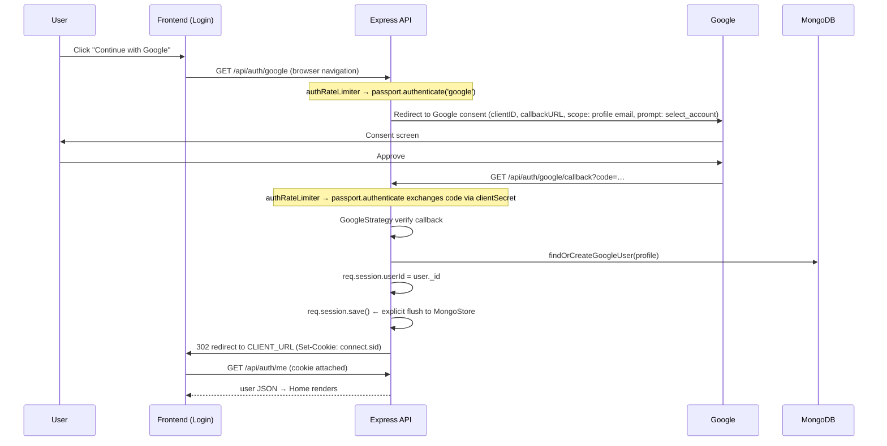

# MyNotes — Complete Technical Documentation

> **Version:** 0.1.0 · **Branch:** `main` · **Stack:** React + TypeScript + Vite · Express + TypeScript · MongoDB + Mongoose · Tauri 2
>
> This document is the complete engineering reference for MyNotes. Every claim is based on the actual source code in this repository. Future ideas are explicitly marked as **NOT IMPLEMENTED**.

---

## Table of Contents

1. [Project Overview](#1-project-overview)
2. [Product Features](#2-product-features)
3. [High-Level Architecture](#3-high-level-architecture)
4. [Repository Structure](#4-repository-structure)
5. [Frontend Architecture](#5-frontend-architecture)
6. [Styling / UI Architecture](#6-styling--ui-architecture)
7. [Frontend Data Flow](#7-frontend-data-flow)
8. [API Client](#8-api-client)
9. [Authentication Architecture](#9-authentication-architecture)
10. [Session Authentication](#10-session-authentication)
11. [Authorization / User Isolation](#11-authorization--user-isolation)
12. [Database Architecture](#12-database-architecture)
13. [Database Indexes](#13-database-indexes)
14. [REST API](#14-rest-api)
15. [Validation](#15-validation)
16. [Rate Limiting](#16-rate-limiting)
17. [Optimistic UI](#17-optimistic-ui)
18. [Race Condition Handling](#18-race-condition-handling)
19. [Trash / Soft Delete](#19-trash--soft-delete)
20. [Notification System](#20-notification-system)
21. [Notification Retry / Backoff](#21-notification-retry--backoff)
22. [Tauri Architecture](#22-tauri-architecture)
23. [Windows Notifications](#23-windows-notifications)
24. [System Tray](#24-system-tray)
25. [Autostart](#25-autostart)
26. [Single Instance](#26-single-instance)
27. [PWA Architecture](#27-pwa-architecture)
28. [Tauri vs PWA Build](#28-tauri-vs-pwa-build)
29. [Build and Packaging](#29-build-and-packaging)
30. [Environment Configuration](#30-environment-configuration)
31. [CORS](#31-cors)
32. [Security Architecture](#32-security-architecture)
33. [Performance](#33-performance)
34. [Accessibility](#34-accessibility)
35. [Responsive Design](#35-responsive-design)
36. [Error Handling](#36-error-handling)
37. [Important Design Decisions](#37-important-design-decisions)
38. [Why Not JWT?](#38-why-not-jwt)
39. [Why Polling Instead of WebSockets?](#39-why-polling-instead-of-websockets)
40. [Known Limitations](#40-known-limitations)
41. [Future Roadmap](#41-future-roadmap)
42. [Troubleshooting](#42-troubleshooting)
43. [Interview Questions](#43-interview-questions)
44. [File-by-File Logic Map](#44-file-by-file-logic-map)
45. [End-to-End Request Examples](#45-end-to-end-request-examples)
46. [Data Flow vs Control Flow](#46-data-flow-vs-control-flow)
47. [Project Strengths](#47-project-strengths)
48. [Tradeoffs](#48-tradeoffs)
49. [Release Information](#49-release-information)
50. [Final Summary](#50-final-summary)

---

## 1. Project Overview

### What is MyNotes?

MyNotes is a full-stack personal notes-and-tasks application. It is a cross-platform productivity tool with three faces:

1. **A responsive web app / PWA** served from `https://mynotes-pooq.onrender.com`
2. **A native Windows desktop app** built with Tauri 2, wrapping the same React frontend
3. **A shared Express + MongoDB backend** at `https://mynote-ydld.onrender.com` that is the single source of truth

### What problem does it solve?

The core problem: **you have a thought on your phone, and you need it on your PC.**

Typing long notes on a phone keyboard is painful. MyNotes lets you capture a thought on your phone in seconds, then find it waiting on your PC when you sit down. The reverse direction matters too: if a task is created from your phone while your PC is on but the app is closed, MyNotes shows a native Windows notification so the task is not forgotten.

### Who is it designed for?

A single individual. MyNotes is a **personal** productivity tool — there are no teams, no sharing, no real-time collaboration, no permissions model beyond "your own data, isolated from everyone else's."

### Core product idea

```
Phone capture  →  Cloud sync  →  PC access
```

- Capture on phone (mobile web / PWA)
- Persist to MongoDB via the Express API
- Access from any browser or the Windows desktop app
- Get notified on the PC when new tasks arrive remotely

### What MyNotes intentionally is NOT

- **Not Jira/Trello** — no boards, sprints, assignments, or workflows
- **Not Notion** — no databases, nesting, or rich documents
- **Not a collaboration platform** — no sharing, teams, mentions, or comments
- **Not offline-first** — an internet connection is required; there is no local sync queue (see [§40 Known Limitations](#40-known-limitations))

### Current release version

**0.1.0** — consistent across `client/package.json`, `server/package.json`, `client/src-tauri/tauri.conf.json`, and `client/src-tauri/Cargo.toml`.

---

## 2. Product Features

Each feature below documents **WHAT** it does, **WHY** it exists, and **HOW** it works technically.

### Notes

- **WHAT:** Freeform text items with a title (≤200 chars) and content (≤5000 chars).
- **WHY:** The basic capture unit — quick thoughts, links, snippets.
- **HOW:** Represented by `type: 'note'` in the Item model. Rendered by `NoteCard.tsx` with a blue `NOTE` pill. Edited through `ComposerModal.tsx` in `editMode`.

### Tasks & completion

- **WHAT:** Items with a boolean completion state and a "Mark complete" / "Completed" button with an animated SVG checkmark.
- **WHY:** Distinguishes actionable items from passive notes.
- **HOW:** `type: 'task'` + `completed: boolean`. The checkmark is a Framer Motion `motion.path` animating `pathLength` from 0→1. Toggling calls `Home.handleToggle`, which PATCHes only `{ completed }`.

### Search

- **WHAT:** Instant, client-side filtering across titles and content.
- **WHY:** Fast retrieval without a round trip.
- **HOW:** `Home.visibleItems` is a `useMemo` that lowercases the query and tests `item.title`/`item.content` with `.includes()`. Re-computed only when `items`, `query`, or `filter` change.

### Filters

- **WHAT:** All / Tasks / Notes / Completed tabs.
- **WHY:** One-click narrowing of the list.
- **HOW:** `FilterTabs.tsx` buttons with `aria-pressed` state; the filter value is applied inside the same `visibleItems` memo.

### Create

- **WHAT:** A "＋ Write something..." trigger opens `ComposerModal`; saving adds the item.
- **WHY:** The primary capture path.
- **HOW:** Optimistic — see [§17](#17-optimistic-ui). A temp-ID item is prepended, the POST runs in background, the server item replaces the temp item.

### Edit

- **WHAT:** The pencil button on each card opens the composer pre-filled; saving updates the card instantly.
- **WHY:** Fixing typos should not feel slower than creating.
- **HOW:** Optimistic PATCH with `editVersions` race protection — see [§17](#17-optimistic-ui) and [§18](#18-race-condition-handling).

### Delete / Trash / Restore / Permanent delete

- **WHAT:** Delete moves an item to a Trash; restore brings it back; "Delete forever" removes it from the database.
- **WHY:** Accidental deletes should be recoverable without a confirmation dialog on every delete.
- **HOW:** Soft delete via `deletedAt` — see [§19](#19-trash--soft-delete).

### Google login

- **WHAT:** One-click sign-in with a Google account.
- **WHY:** No password management, no signup friction, and the profile (name, email, avatar) comes for free.
- **HOW:** Passport GoogleStrategy + server-side sessions — see [§9](#9-authentication-architecture).

### Profile management

- **WHAT:** `ManageProfileModal` shows avatar + name, lets the user edit the display name (≤100 chars), and shows read-only email with a lock icon.
- **WHY:** The Google name is often not the name the user wants displayed.
- **HOW:** `PATCH /api/auth/me` with server-side validation. Custom names survive re-login — see [§9](#9-authentication-architecture).

### Settings

- **WHAT:** `SettingsModal` with an Appearance section (informational "Theme: Light"), a Desktop Notifications toggle (Tauri only, persisted in `localStorage` under `mynotes:desktop-notifications`), and an About section with the version.
- **WHY:** Users need a kill switch for notifications without leaving the app.
- **HOW:** The toggle writes via `setNotificationEnabled()`; the poller reads `isNotificationEnabled()` on every tick, so toggling takes effect within one 20s cycle.

### Notifications

- **WHAT:** Generic Windows toasts ("You have a new task." / "You have new tasks.") when tasks are created from another device while the app is in the background.
- **WHY:** The phone→PC workflow's endpoint.
- **HOW:** Chained 20s polling + WinRT toasts — see [§20](#20-notification-system) and [§23](#23-windows-notifications).

### PWA

- **WHAT:** The web build is installable and runs standalone.
- **HOW:** vite-plugin-pwa with `autoUpdate`, precached static assets, no API caching — see [§27](#27-pwa-architecture).

### Windows desktop app

- **WHAT:** A native NSIS/MSI installer wrapping the same UI in a WebView2 shell with tray, notifications, autostart, and single-instance behavior.
- **HOW:** Tauri 2 — see [§22](#22-tauri-architecture).

### Optimistic UI

- **WHAT:** All five mutations (create/edit/toggle/delete/restore) update the screen immediately and reconcile in the background.
- **WHY:** Perceived latency drops to zero.
- **HOW:** See [§17](#17-optimistic-ui).

### Responsive UI & skeleton loading

- **WHAT:** The layout adapts from 320px phones to wide desktops; the initial item fetch shows three shimmering skeleton cards instead of a spinner.
- **HOW:** CSS-only — see [§6](#6-styling--ui-architecture) and [§35](#35-responsive-design).

---

## 3. High-Level Architecture

```
┌─────────────────────────┐      ┌──────────────────────────┐
│   Browser / PWA         │      │  Windows Desktop (Tauri) │
│  mynotes-pooq.onrender  │      │  mynotes.exe             │
│                         │      │                          │
│  React 19 + TypeScript  │      │  Rust shell (tray, toasts│
│  Vite build, served as  │      │  autostart, single-inst.)│
│  static assets          │      │        │                 │
│        │                │      │        ▼                 │
│        │                │      │  WebView2                │
│        │                │      │  (same React frontend,   │
│        │                │      │   embedded in binary)    │
└────────┼────────────────┘      └────────┼─────────────────┘
         │  fetch (credentials: 'include')│
         │  + connect.sid cookie          │
         ▼                                ▼
┌─────────────────────────────────────────────────────┐
│           Express API (TypeScript)                  │
│        mynote-ydld.onrender.com                     │
│                                                     │
│  CORS → JSON parser → session → passport → routes   │
│    │                                                │
│    ├─ requireAuth (session-derived userId)          │
│    ├─ validate (body shape, ObjectId)               │
│    └─ rate-limit (auth: 10/15min, api: 120/min)     │
└────────────────────┬────────────────────────────────┘
                     │ Mongoose
                     ▼
┌─────────────────────────────────────────────────────┐
│                    MongoDB                          │
│   users (googleId, name, email, avatarUrl)          │
│   items (userId, title, content, type, completed,   │
│          deletedAt, notificationState)              │
│   sessions (connect-mongo collection)               │
└─────────────────────────────────────────────────────┘
```

**Key architectural rule:** the server and its MongoDB database are the **source of truth**. The React client holds a *projection* of that truth in local state and reconciles after every mutation. Two clients (phone and PC) never talk to each other — they both talk to the API, and the API arbitrates.

**Client-side responsibilities:** rendering, optimistic state, search/filter (on the already-fetched list), notification polling, localStorage notification preference.

**Server-side responsibilities:** authentication, session storage, user identity, all data queries (always scoped by server-derived `userId`), validation, rate limiting, notification state transitions.

---

## 4. Repository Structure

```
MyNotes/
├── client/                       # Frontend + desktop shell
│   ├── src/
│   │   ├── components/           # All UI components (13 files)
│   │   ├── pages/                # Home.tsx (authenticated), Login.tsx
│   │   ├── hooks/                # useFocusTrap.ts
│   │   ├── lib/                  # api.ts, notifications.ts, utils.ts
│   │   ├── types/                # note.ts (NoteItem, ItemFilter), user.ts
│   │   ├── App.tsx               # Auth gate + notification poller start
│   │   ├── main.tsx              # React root
│   │   └── styles.css            # Entire design system (~1100 lines)
│   ├── src-tauri/                # Tauri 2 shell
│   │   ├── src/lib.rs            # ALL desktop Rust logic
│   │   ├── tauri.conf.json       # Window, bundle, identifier config
│   │   ├── Cargo.toml            # Rust deps (winreg, tauri-winrt-notification…)
│   │   └── icons/                # App icons for bundling
│   ├── scripts/
│   │   └── tauri-frontend-build.mjs  # Desktop build guard (API URL + PWA skip)
│   ├── public/                   # PWA icons (icon-192/512, maskable)
│   ├── dist/                     # Build output (gitignored)
│   ├── vite.config.ts            # Vendor chunking + conditional PWA
│   └── package.json
├── server/
│   └── src/
│       ├── config/               # env.ts (typed env access), passport.ts
│       ├── controllers/          # auth.controller.ts, item.controller.ts
│       ├── services/             # auth.service.ts, item.service.ts (business logic)
│       ├── middleware/           # auth, session, validate, rate-limit, error
│       ├── models/               # Item.ts, User.ts (Mongoose schemas)
│       ├── routes/               # auth.routes.ts, item.routes.ts
│       ├── types/                # Shared server types (ItemDTO, inputs…)
│       ├── utils/                # current-user.ts
│       ├── db/connect.ts         # Mongoose connection
│       └── server.ts             # Express app assembly + startup
├── docs/                         # This documentation
└── README.md
```

**Directory responsibilities:**

| Directory | Responsibility |
|---|---|
| `client/src/components/` | One file per UI concern; all presentational/interactive units. `Home.tsx` is the stateful orchestrator in `pages/`. |
| `client/src/lib/` | Framework-agnostic client logic: HTTP wrapper, notification engine, pure helpers. |
| `client/src/hooks/` | Reusable React behavior (focus trapping). |
| `client/src/types/` | The client's view of API shapes (`NoteItem`) — intentionally mirrors `server/src/types/ItemDTO`. |
| `client/src-tauri/` | Everything native: window lifecycle, tray, toasts, registry, autostart, single-instance. |
| `server/src/routes/` | Thin wiring: path → middleware chain → controller. |
| `server/src/controllers/` | HTTP concerns: read request, call service, shape response (`toItemDTO`). |
| `server/src/services/` | Business logic + all Mongoose queries. No HTTP concepts here. |
| `server/src/models/` | Schema definitions, indexes, and document types. |
| `server/src/middleware/` | Cross-cutting concerns: auth gate, session setup, validation, rate limits, centralized errors. |
| `server/src/config/` | Env access (`env.ts`) and Passport wiring. |

---

## 5. Frontend Architecture

### Stack

React 19, TypeScript (strict), Vite 7. No router — the app has exactly two states (logged out → `Login`, logged in → `Home`) selected by an auth check in `App.tsx`. No state library — React state + refs.

### Component hierarchy

```
App.tsx
├── (loading)      → ⏳ spinner + OfflineIndicator
├── (!user)        → Login.tsx (Google button) + OfflineIndicator
└── (user)         → Home.tsx
    ├── Topbar: Brand + SearchBar + ProfileMenu
    │              └── ProfileMenu → ManageProfileModal / SettingsModal / DeletedModal
    ├── Hero copy + composer-trigger button
    ├── FilterTabs
    ├── Error banner (role="alert") w/ Retry
    ├── notes-grid → NoteCard[] (memoized, inside AnimatePresence)
    │                 └── NoteCardSkeleton[] while loading
    └── ComposerModal (create or edit, AnimatePresence)
```

### State ownership: why `Home` owns the list

All items live in one `useState<NoteItem[]>` inside `Home`. Every mutation handler lives there too. This is deliberate:

1. **Single source of client truth.** Five optimistic mutations all need read-modify-write access to the same list. Splitting ownership across components would require lifting state anyway or introducing a store.
2. **Simple rollback.** Rollback = `setItems(...)` with the captured snapshot. No store middleware, no undo stack.
3. **Simple cross-mutation coordination.** Race guards (e.g. "don't roll back an edit if the item was deleted") need to see all in-flight operations — they all sit in the same component as refs.

Children are intentionally dumb: `NoteCard` receives `item` + four stable callbacks and nothing else.

### `itemsRef` — the synchronous mirror

```ts
const itemsRef = useRef<NoteItem[]>(items)
useEffect(() => { itemsRef.current = items }, [items])
```

**Why it exists:** `useCallback(fn, [])` captures variables from the first render. If `handleToggle` closed over the `items` array, it would read a stale list forever. But re-creating callbacks on every `items` change would defeat `memo()` on `NoteCard` (every keystroke in search would re-render every card).

The solution: callbacks close over the **ref** (stable identity), and the ref's `.current` is refreshed to the latest `items` right after every commit. Handlers read `itemsRef.current` at call time → always fresh data, always stable function identity.

### Stable callbacks & `memo()`

```ts
const handleDelete = useCallback(async (id: string) => { … }, [])
const handleToggle = useCallback(async (id: string) => { … }, [])
const openEditor  = useCallback((item: NoteItem) => { … }, [])
```

`NoteCard` is wrapped in `React.memo`. Its props are: `item` (object identity changes only for the item that actually changed), `onDelete`, `onToggleTask`, `onEdit` (all `useCallback`-stable). Therefore typing in the search box re-renders only `Home`'s shell and cards whose `item` object changed — not all of them. `handleCreate`/`handleUpdate` are plain functions (they depend on `editingItem` state) but are only passed to `ComposerModal`, which unmounts between uses, so they don't affect card memoization.

### NoteCardSkeleton

Three static `<article className="note-card skeleton-card" aria-hidden="true">` placeholders rendered while `loading === true`. Pure CSS shimmer (no JS timers). Hidden from screen readers; the grid carries `aria-busy="true"` instead.

---

## 6. Styling / UI Architecture

### Plain CSS, not Tailwind

The entire design system is one hand-written `styles.css` (~1100 lines). It was kept plain because the design language is small, specific, and cohesive — a soft neo-brutalist system with ~10 colors and 3 shadow tiers — and a utility framework would add a build dependency and a different authoring model without payoff at this scale. Custom properties and a few utility classes (`.visually-hidden`) provide the needed structure.

### Design tokens (actual values from styles.css)

| Token | Value | Used for |
|---|---|---|
| Background | `#f7f6f2` | Page, modals — warm off-white |
| Ink | `#111` | Text, 2px borders, hard shadows |
| Surface | `#fff` | Cards |
| Hover accent | `#fff9b8` | Buttons, menu items on hover |
| Task pill | `#ff9b9b` | Coral — task label |
| Note pill | `#b8e3ff` | Blue — note label |
| Completed | `#baff9b` + `opacity: .58` | Checked checkbox, dimmed card |
| Heading font | Caveat (handwritten) | Brand, headings |
| Body font | Inter | Everything else |

**Shadow language:** cards use `5px 5px 0 #111` (hard offset); smaller controls use `3px 3px 0 #111`. No blurs, no gradients, no glassmorphism — by design.

### Modal system

There are **4 actual modals**, and all of them share one pattern: a `motion.div.modal-backdrop` (fade) wrapping a `motion.div` panel (fade + 12–18px rise). Backdrop `onMouseDown` closes (Composer only when not dirty). Every one of them: `role="dialog"`, `aria-modal="true"`, Escape closes, `useFocusTrap` manages focus:

1. **ComposerModal**
2. **ManageProfileModal**
3. **SettingsModal**
4. **DeletedModal**

The **ProfileMenu dropdown is NOT a modal/dialog.** It is a separate `role="menu"` dropdown with its own outside-click, Escape-key, and arrow-key handling — it does **not** use `useFocusTrap`.

### Responsive behavior

| Breakpoint | What changes |
|---|---|
| `> 700px` | Desktop search input always visible |
| `≤ 700px` | Search collapses to a 42px icon button; tapping expands a full-width overlay row with back arrow + auto-focused input + clear button (Escape/outside-click collapses; the query is preserved) |
| `≤ 500px` | Tighter spacing adjustments |

Overflow safety is achieved structurally, not by blanket `overflow-x: hidden`: `box-sizing: border-box` globally, `min-width: 0` on flex/grid children, `overflow-wrap: anywhere` on card text and emails, `max-height: calc(100vh - 40px); overflow-y: auto` on modals, and `max-width: calc(100vw - 24px)` on the profile dropdown so it can't leave the viewport on mobile.

### Scrollbar

The page scrollbar is visually hidden (`scrollbar-width: none` + `::-webkit-scrollbar { display: none }`) while **scrolling itself remains fully functional** — only the visual track is removed.

### Reduced motion

```css
@media (prefers-reduced-motion: reduce) {
  .skeleton-pill, .skeleton-icon, .skeleton-line {
    animation: none; background: #e8e7e3;
  }
}
```

Skeletons become static gray blocks; the animation (the only CSS keyframe loop in the app) stops.

---

## 7. Frontend Data Flow

### Full lifecycle

```
App mounts
  → getCurrentUser() (GET /auth/me)            [App.tsx]
      ├─ 200 → setUser(user); if Tauri → startNotificationPolling()
      └─ 401 → setUser(null)
  → user ? <Home> : <Login>

Home mounts
  → refreshItems() (GET /items)                [useEffect]
      → setLoading(true) → skeleton grid
      → 200 → setItems(data); setLoading(false) → real cards
      → error → setError(msg) → red banner + Retry

User mutation (create/edit/toggle/delete/restore)
  → optimistic setItems(...)                   [instant]
  → api.<method>(...)                          [background]
      ├─ 2xx → reconcile / clear error
      └─ throw → rollback via setItems + setError(msg)
```

**Exact functions involved:**

| Step | Function | File |
|---|---|---|
| Auth check | `getCurrentUser()` | `App.tsx` → `api.ts` |
| Initial fetch | `refreshItems()` | `Home.tsx` |
| Create | `handleSave` → `handleCreate` | `Home.tsx` |
| Edit | `handleSave` → `handleUpdate` | `Home.tsx` |
| Toggle | `handleToggle` | `Home.tsx` |
| Delete | `handleDelete` | `Home.tsx` |
| Restore | `DeletedModal.handleRestore` → `onRestore` → `handleRestoreItem` | `DeletedModal.tsx` → `ProfileMenu.tsx` → `Home.tsx` |
| Logout | `handleLogout` | `Home.tsx` |

---

## 8. API Client

`client/src/lib/api.ts` — a single `request<T>()` wrapper over `fetch`.

### Base URL

```ts
const BASE_URL = import.meta.env.VITE_API_URL || 'http://localhost:5000/api'
```

Production web builds get `VITE_API_URL` at build time; desktop builds get it from `client/.env.tauri` via the build script; dev falls back to localhost.

### The wrapper

```ts
async function request<T>(path, options = {}, okStatuses: readonly number[] = []): Promise<T>
```

Key behaviors:

1. **`credentials: 'include'`** on every request — this is what makes the browser attach the `connect.sid` session cookie. Without it, session auth silently fails, especially cross-origin (web app on `mynotes-pooq`, API on `mynote-ydld`).
2. **`Content-Type: application/json`** merged under caller headers.
3. **`okStatuses` escape hatch:** certain non-2xx statuses are *acceptable outcomes*. `deleteItem` and `permanentDeleteItem` pass `[404]` — a 404 means the item was already gone, which is the same final state, so it's treated as success and `void` is returned without parsing a body.
4. **Error normalization:** non-OK (and not in `okStatuses`) → try to parse `{ error }` from the body; fall back to `Request failed (<status>)`; throw a single `Error` with a human-readable message. The server's validation messages therefore surface directly in the UI error banner.

Exported functions: `getItems`, `createItem`, `updateItem(id, partial)`, `deleteItem`, `getDeletedItems`, `restoreItem`, `permanentDeleteItem`, `getCurrentUser`, `updateProfile(name)`, `logout`, `getGoogleAuthUrl` (used as an `<a href>` so the browser navigates to Google — not an XHR).

---

## 9. Authentication Architecture

### Step-by-step Google OAuth flow



### Each step in detail

1. **Initiation** (`auth.routes.ts`): `GET /google` → `authRateLimiter` → `passport.authenticate('google', { scope: ['profile','email'], prompt: 'select_account' })`. The `prompt` forces the account chooser so a user with multiple Google accounts can switch.

2. **Callback** (`GET /google/callback`): rate-limited, then Passport exchanges the authorization code for tokens using `GOOGLE_CLIENT_SECRET`, and calls the **verify callback** in `config/passport.ts`.

3. **Verify callback** extracts `profile.id`, first email, `displayName`, first photo, then delegates to `authService.findOrCreateGoogleUser`.

4. **`findOrCreateGoogleUser`** (`auth.service.ts`):
   - `findOne({ googleId })`
   - **Not found** → `UserModel.create({ googleId, email, name, avatarUrl })` — the Google name is used *once*, at creation.
   - **Found** → sync only fields Google owns: `email` and `avatarUrl`, and only when they actually changed (conditional `save()` — no pointless DB writes). **`name` is never touched here.** This is the fix for the "custom display name lost on re-login" bug: the name set via Manage Profile would otherwise be overwritten by `profile.displayName` on every login. Name is set once at creation, then owned exclusively by the user through `PATCH /api/auth/me`.

5. **Session creation** (`auth.controller.ts → googleCallback`):
   ```ts
   req.session.userId = user._id.toString()
   req.session.save(() => res.redirect(env.clientUrl))
   ```
   The explicit `save()` matters: Passport has already touched the session (regenerating it for fixation protection), and without a manual flush the `userId` write can race the redirect — the browser can arrive with a cookie whose session in Mongo doesn't contain `userId` yet, producing a login loop. `save()` guarantees the MongoStore write completes *before* the redirect is sent.

6. **Serialization** — Passport's `serializeUser` stores the user id in the session; `deserializeUser` loads the document by id on subsequent requests. (MyNotes' own routes mostly read `req.session.userId` directly rather than relying on `req.user`.)

### Why not JWT?

See the dedicated section [§38](#38-why-not-jwt). Short version: server-side revocation, simple cross-origin cookie model, and no token-refresh machinery for a single-user-per-device app.

---

## 10. Session Authentication

### Configuration (`middleware/session.ts`)

```ts
session({
  secret: env.sessionSecret,
  resave: false,                // don't rewrite unchanged sessions
  saveUninitialized: false,     // no session until something is stored
  cookie: {
    secure: env.isProduction,          // HTTPS-only in prod
    httpOnly: true,                    // invisible to document.cookie / JS
    maxAge: 7 * 24 * 60 * 60 * 1000,   // 7 days
    sameSite: env.isProduction ? 'none' : 'lax',
  },
  store: MongoStore.create({ mongoUrl, collectionName: 'sessions' }),
})
```

### Why `sameSite: 'none'` in production

The web frontend (`mynotes-pooq.onrender.com`) and API (`mynote-ydld.onrender.com`) are **different sites**. A `Lax` cookie is not sent on cross-site `fetch()` calls — the cookie was created fine, but `GET /api/auth/me` arrived cookie-less → 401 → the login loop this config fixed. `SameSite=None` allows the cookie on cross-site requests; it **requires** `Secure`, which production guarantees. In development (same-site localhost:5173 → localhost:5000), `Lax` is correct and safer.

### Cookie properties and what each buys

| Property | Value | Protects against |
|---|---|---|
| `httpOnly` | always | XSS stealing the session id via `document.cookie` |
| `secure` | prod only | Cookie sniffing over plain HTTP |
| `sameSite` | `none`+`Secure` (prod) / `lax` (dev) | Most CSRF (Lax blocks cross-site POSTs); None is required here purely because of the cross-site split |
| `maxAge` | 7 days | Indefinite session validity |

### The store: why MongoStore

Default `MemoryStore` loses every session on restart (everyone gets logged out) and doesn't scale beyond one process. `connect-mongo` persists sessions in the `sessions` collection, so restarts/deployments preserve logins, and the store is TTL-managed by MongoDB itself.

### Full request lifecycle

```
Browser                    Express                         MongoDB
   │  GET /api/items          │                               │
   │  Cookie: connect.sid=…   │                               │
   ├─────────────────────────►│  session middleware           │
   │                          │  ├─ parse sid (signed w/ secret)
   │                          │  ├─ MongoStore.get(sid) ─────►│ sessions.findOne({_id: sid})
   │                          │  ◄─── session doc ────────────│
   │                          │  └─ req.session = { userId }  │
   │                          │  requireAuth:                 │
   │                          │   req.session.userId ?        │
   │                          │     req.userId = it; next()   │
   │                          │   : 401 {error:'Unauthorized'}│
   │                          │  controller → service ───────►│ items.find({userId,…})
   │ ◄─── 200 JSON ───────────│                               │
```

### Why the client never sends userId

The client has no way to assert identity. `userId` is never an accepted input on any endpoint — the server reads it exclusively from the session that the signed, httpOnly cookie resolved to. A malicious client can only ever act as the user whose cookie it holds. (See `utils/current-user.ts` — `getCurrentUserId(req)` reads `req.userId`, which only `requireAuth` sets from `req.session.userId`.)

### Logout (`auth.controller.ts → logout`)

```ts
req.session.destroy(err => { …
  res.clearCookie('connect.sid', {
    httpOnly: true, secure: env.isProduction,
    sameSite: env.isProduction ? 'none' : 'lax', path: '/',
  })
})
```

The `clearCookie` options **must match** the cookie's original attributes. Browsers treat `Set-Cookie` entries as keyed by name + attribute set; a clearing header without `Secure`/`SameSite` won't match a `Secure; SameSite=None` cookie and is silently ignored — leaving the user logged in. This exact bug existed and was fixed by passing matching options.

---

## 11. Authorization / User Isolation

MyNotes has one authorization rule — **you can only ever touch your own items** — enforced at three layers:

1. **Identity comes only from the session.** `requireAuth` is the sole place `req.userId` is set, and it reads `req.session.userId` (which only the OAuth callback wrote). No route accepts a user id from body, query, or header.

2. **Every query/filter includes `userId`.** In `item.service.ts`:

| Operation | Mongo filter |
|---|---|
| List active | `{ userId, deletedAt: null }` |
| List deleted | `{ userId, deletedAt: { $ne: null } }` |
| Update | `{ _id: itemId, userId, deletedAt: null }` (findOneAndUpdate) |
| Soft delete | `{ _id: itemId, userId, deletedAt: null }` (updateOne) |
| Restore | `{ _id: itemId, userId, deletedAt: { $ne: null } }` |
| Permanent delete | `{ _id: itemId, userId }` (deleteOne) |
| Pending notifications | `{ userId, type: 'task', notificationState: 'pending', deletedAt: null }` |

Because `userId` is part of the match, guessing another user's ObjectId yields a zero-match update/delete — the service returns `null`/`false` and the controller answers `404 Item not found.` There is no information leak (a 403 would confirm the id exists; 404 does not).

3. **Notification endpoints are scoped the same way** — the pending count and delivered-batch only ever touch the caller's items.

**Why client-supplied userId would be unsafe:** with `trust proxy` and public endpoints, any unauthenticated client could pass `userId: <victim>` and read/write their data. Server-derived identity from a signed, httpOnly session cookie is the only trustworthy source.

---

## 12. Database Architecture

MongoDB via Mongoose 8. Two collections plus the session store.

### User model (`models/User.ts`)

| Field | Type | Notes |
|---|---|---|
| `googleId` | String | **required, unique** — the identity anchor |
| `email` | String | required, lowercased + trimmed |
| `name` | String | required, trimmed — user-owned after creation |
| `avatarUrl` | String | Google photo, nullable |
| `createdAt` / `updatedAt` | Date | Mongoose `timestamps: true` |

### Item model (`models/Item.ts`)

| Field | Type | Notes |
|---|---|---|
| `_id` | ObjectId | Mongo PK |
| `userId` | String | required — owner (the User `_id` as string) |
| `title` | String | required, trimmed, maxlength 200, validator: non-empty |
| `content` | String | default `''`, trimmed, maxlength 5000 |
| `type` | String | enum `['note','task']`, required |
| `completed` | Boolean | default `false` |
| `notificationState` | String | enum `['pending','delivered']`, default `'pending'` |
| `deletedAt` | Date | default `null` — the soft-delete marker |
| `createdAt` / `updatedAt` | Date | timestamps |

### Why `deletedAt` instead of deleting

See [§19](#19-trash--soft-delete). Summary: recoverable deletes, an audit-friendly timestamp, and a single field that cleanly partitions active vs deleted query spaces — with a compound index making both fast.

### `notificationState` lifecycle

- `createItem` → `'pending'` (a new task may deserve a toast on the user's other device)
- `markNotificationsDelivered` → batch-set `'delivered'` after a toast actually displayed
- `deleteItem` (soft delete) → also set to `'delivered'` **in the same atomic updateOne** — deleting a pending task permanently cancels its notification, so restoring it later cannot resurrect a stale toast

---

## 13. Database Indexes

Two indexes on the Item collection (`models/Item.ts`):

### 1. `{ userId: 1, createdAt: -1 }`

Accelerates `getItems`: `find({ userId, deletedAt: null }).sort({ createdAt: -1 })`. The prefix `userId` makes the filter selective; the `createdAt: -1` direction matches the sort, so MongoDB can walk the index in order and skip an in-memory sort entirely.

### 2. `{ userId: 1, deletedAt: 1 }`

Accelerates the trash query `find({ userId, deletedAt: { $ne: null } }).sort({ deletedAt: -1 })`, the notification queries (`deletedAt: null` equality), and every ownership check that combines `_id + userId`. It also serves the active-items filter (`deletedAt: null` equality).

### Why no other indexes

The current implementation does not define a dedicated `{ userId, notificationState }` compound index. The notification queries already filter on `userId + deletedAt` (covered by index 2), and the collection for a single user is small — an additional index would cost write throughput and storage for negligible read gain. Likewise, no standalone single-field index on `userId` exists: both compound indexes share that prefix, so such an index would be redundant.

### `.lean()`

Every read path (`getItems`, `getDeletedItems`, and the `findOneAndUpdate…lean()` variants) uses `.lean()`, which returns plain JS objects instead of hydrated Mongoose documents. This skips building the document prototype, applying getters/virtuals, and change tracking — materially less CPU and allocation on every list fetch. It's safe here because reads are immediately serialized to DTOs and never saved back.

---

## 14. REST API

Base: `/api`. Auth column: 🔓 public, 🔐 session required.

### Health

| Method | Route | Auth | Purpose |
|---|---|---|---|
| GET | `/api/health` | 🔓 | Liveness probe → `{ ok: true, service: 'mynotes-api' }` |

### Auth (`routes/auth.routes.ts`)

| Method | Route | Auth | Request | Response | Notes |
|---|---|---|---|---|---|
| GET | `/auth/google` | 🔓 | — | 302 → Google | `authRateLimiter`; `prompt: select_account` |
| GET | `/auth/google/callback` | 🔓 | ?code=… | 302 → `CLIENT_URL` | `authRateLimiter`; creates session, sets cookie |
| GET | `/auth/me` | 🔓* | — | `AuthUserDTO` or 401 | *Reads session directly; returns `{error:'Not authenticated'}` 401 when absent. Corrupt sid → generic 500 (intentional, byte-identical with Phase-3 behavior) |
| PATCH | `/auth/me` | 🔐 | `{ name }` | `AuthUserDTO` | name: non-empty string, ≤100 after trim |
| POST | `/auth/logout` | 🔓 | — | `{ message }` | `authRateLimiter`; destroys session + matching clearCookie |

`AuthUserDTO`: `{ id, name, email, avatarUrl: string | null }`.

### Items (`routes/item.routes.ts`)

| Method | Route | Auth | Request | Response | Validation |
|---|---|---|---|---|---|
| GET | `/items` | 🔐 | — | `ItemDTO[]` (active only, newest first) | — |
| GET | `/items/deleted` | 🔐 | — | `ItemDTO[]` (deleted, newest-deleted first) | — |
| POST | `/items` | 🔐 | `{ title, content?, type }` | 201 `ItemDTO` | title non-empty ≤200; content ≤5000; type ∈ {task, note} |
| PATCH | `/items/:id` | 🔐 | partial `{ title?, content?, type?, completed? }` | `ItemDTO` or 404 | all-optional but ≥1 field required; per-field rules; id must be a valid ObjectId |
| PATCH | `/items/:id/restore` | 🔐 | — | `ItemDTO` or 404 | id ObjectId; only works if currently deleted |
| DELETE | `/items/:id` | 🔐 | — | `{ message }` or 404 | soft delete |
| DELETE | `/items/:id/permanent` | 🔐 | — | `{ message }` or 404 | hard delete |

### Notifications

| Method | Route | Auth | Response | Notes |
|---|---|---|---|---|
| GET | `/items/notifications/pending` | 🔐 | `{ count: number }` | Count only — no item content (privacy) |
| POST | `/items/notifications/delivered` | 🔐 | `{ message, modifiedCount }` | Batch-marks all pending → delivered |

`ItemDTO`: `{ id, title, content, type, completed, notificationState, deletedAt: string|null, createdAt, updatedAt }`.

Route ordering note: `/deleted` and `/notifications/*` are registered so they cannot be captured by `/:id` patterns.

---

## 15. Validation

All validation lives in `middleware/validate.ts` (pure parse functions + thin Express wrappers) plus `validateItemIdParam`.

### Rules

| Field | Create | Update |
|---|---|---|
| `title` | required string, non-empty after trim, ≤200 | optional; if present, same rules |
| `content` | optional, default `''`, string, ≤5000 | optional, same |
| `type` | required, must be `'task'` or `'note'` | optional, same enum |
| `completed` | not accepted (server sets `false`) | optional, must be boolean |
| `:id` param | — | must pass `isValidObjectId` → else 400 `Invalid item id.` |

Rejection shape: `400 { error: '<message>' }` — same messages as the original Phase-2 implementation.

**Unknown fields are dropped, not rejected:** the parser whitelists exactly `title/content/type/completed`. A client cannot smuggle `userId`, `_id`, `createdAt`, or `notificationState` — `updateItem` passes only the validated object to `findOneAndUpdate`.

### Why validate on the server when the frontend already validates?

The frontend's `maxLength` attributes and trim checks are UX, not security. Anyone can `curl -X POST` with arbitrary JSON. Server validation is the only boundary that actually holds: it protects schema integrity (Mongoose validators as a second net), prevents nonsense states, and guards the whitelist that keeps server-managed fields out of client reach.

### Body size

`express.json({ limit: '100kb' })` in `server.ts` — a malformed or oversized body yields `err.type === 'entity.parse.failed'` → 400 `Invalid JSON body` (or 413 from Express) instead of a hang.

---

## 16. Rate Limiting

`middleware/rate-limit.ts` — `express-rate-limit` v8, in-memory store, keyed by IP (which respects `app.set('trust proxy', 1)` behind Render's proxy, so real client IPs are counted, not the proxy's).

### The two limiters

| Limiter | Window | Limit | Applied to |
|---|---|---|---|
| `authRateLimiter` | 15 min | 10 req | `GET /auth/google`, `GET /auth/google/callback`, `POST /auth/logout` |
| `apiRateLimiter` | 1 min | 120 req | All 9 `/items/*` routes |

**Not limited:** `GET /auth/me` (cheap session read on every app load), `PATCH /auth/me` (low-frequency, already behind `requireAuth`), `/api/health` (monitoring must not be throttled).

### Why different limits

Auth endpoints are the abuse surface: OAuth initiation can be spammed to flood Google's redirect flow and burn the client quota; logout spam wastes session-store writes. 10/15min is far above any human's login cadence (1–2 per login) but caps scripted abuse. The API limiter is deliberately generous — the desktop poller makes ~3 req/min (pending + delivered after a toast), and normal usage is well under 20 req/min — 120/min blocks only runaway loops.

### Response behavior

On exceed: **429** with a JSON body matching the app's error shape (`{ error: 'Too many requests…' }`), a `RateLimit` draft-7 header, and a `Retry-After` header supplied by the library. The frontend's error wrapper parses the `{ error }` body, so the message lands in the standard banner.

### What it protects against — and what it doesn't

- ✅ Brute-forcing the OAuth entry point, runaway client loops, accidental infinite re-render fetch storms, session-write abuse.
- ❌ **Not** DDoS protection — the in-memory store is per-process, so limits reset on deploy/restart and don't aggregate across multiple instances; a volumetric attack is absorbed by Render/Cloudflare before reaching the app. It's a seatbelt, not a wall.

---

## 17. Optimistic UI

### The concept

**Optimistic UI means we update the screen before waiting for the server.** The user's intent is applied to local state instantly; the network request happens in the background; the server response either confirms (keep the optimistic state) or fails (roll back and show an error). The perceived latency of every mutation drops to zero.

MyNotes applies this to **all five** mutations. Here is each one as implemented in `Home.tsx` (and `DeletedModal.tsx` for restore).

### CREATE — `handleCreate(title, content, type)`

1. **User action:** submit in `ComposerModal` (create mode).
2. **Local state:** mint `tempId = 'temp-' + crypto.randomUUID()`; build `optimisticItem` (completed `false`); register it in `pendingCreates` ref; `setItems([optimisticItem, ...current])`; close the composer.
3. **API:** `POST /items` in the background.
4. **Success:** if `cancelledCreates.has(tempId)` (user deleted it meanwhile) → delete the server orphan via `api.deleteItem(newItem.id)` (best-effort) and stop. Otherwise replace the temp item in place with the canonical server item. If the user toggled completion while the POST was in flight, the local intent is kept (`reconciled.completed = local.completed`) and synced with a follow-up `updateItem`.
5. **Failure:** remove the temp item; surface the error only if the create wasn't cancelled.
6. **Rollback:** filter out the temp id.
7. **Race protection:** `pendingCreates` (map tempId → optimistic item, so a toggle during flight can be merged), `cancelledCreates` (set of tempIds the user deleted pre-confirmation), double-submit guard `submitted` ref inside the composer.

### EDIT — `handleUpdate(title, content, type)`

1. **User action:** submit in `ComposerModal` (edit mode, `editingItem` set).
2. **Local state:** capture `previous` from `itemsRef.current`; bump `editVersions` for that id; `setItems(map → { ...item, title, content, type })`; close the modal **immediately**.
3. **API:** `PATCH /items/:id` with `{ title, content, type }` only.
4. **Success:** keep optimistic state; clear the error banner.
5. **Failure:** only if this edit is still the newest for the item (`editVersions.get(id) === capturedVersion + 1`), restore `previous` into its slot and show the error. If a newer edit superseded it, the stale failure is **silently ignored**.
6. **Rollback:** positional replace — `findIndex` by id; if `-1` (item was deleted/replaced), do nothing.
7. **Race protection:** `editVersions` — see [§18](#18-race-condition-handling). Note the PATCH sends only the three editable fields; `completed` is never included, so an edit can never clobber a concurrent toggle.

### DELETE — `handleDelete(id)`

1. **User action:** trash icon on a card.
2. **Local state:** temp-id items take a fast path (cancel the pending create, no server call yet). Real items: duplicate-DELETE guard via `pendingDeleteIds`; capture `previous` + `index`; `setItems(filter)`.
3. **API:** `DELETE /items/:id` (soft delete server-side; 404 tolerated as success).
4. **Success:** clear error.
5. **Failure:** re-insert `previous` at `Math.min(index, next.length)` — but only if the id isn't already present (prevents duplication if something else re-added it).
6. **Rollback:** positional splice-in.
7. **Race protection:** `pendingDeleteIds` (no duplicate DELETEs), existence check before rollback (no resurrection of a hard-deleted item), and interplay with `cancelledCreates` for temp items.

### TOGGLE — `handleToggle(id)`

1. **User action:** click "Mark complete" / "Completed".
2. **Local state:** flip `completed` immediately; temp items also update `pendingCreates` so the intent survives the POST reconciliation.
3. **API:** `PATCH /items/:id` with `{ completed: target }` only.
4. **Success:** replace the item with the server response **only if** this toggle is still the latest (`toggleTargets.get(id) === target`).
5. **Failure:** flip back only if still latest; show error otherwise.
6. **Rollback:** set `completed` to `!target`.
7. **Race protection:** `toggleTargets` (map id → intended boolean). A redundant click with the same target while in flight is ignored; an opposite click **supersedes** the in-flight request — when the older request settles, its `isLatest` check fails and it neither overwrites state nor errors. Latest-wins semantics.

### RESTORE — `DeletedModal.handleRestore(id)` + `Home.handleRestoreItem`

1. **User action:** Restore button in the Deleted modal.
2. **Local state (modal):** remove the item from the deleted list immediately (snapshot `previous` for rollback).
3. **API:** `PATCH /items/:id/restore`.
4. **Success:** the **canonical** server item is passed up via the `onRestore(item)` prop chain (`DeletedModal → ProfileMenu → Home`). `handleRestoreItem` inserts it into Home's list — replacing by id if somehow already present (duplicate protection), otherwise inserting at the correct position for the newest-first `createdAt` ordering. No refetch of `GET /items` occurs.
5. **Failure:** roll the modal's list back; show the modal's error banner. Home is never touched on failure.
6. **Rollback:** `setItems(previous)` inside the modal.
7. **Race protection:** duplicate-id replace in `handleRestoreItem`; stale-snapshot protection in the modal via the `previous` array captured at click time.

---

## 18. Race Condition Handling

These are real interleavings the code is written to survive. For each: what could go wrong, and what actually protects it.

### Edit → Edit

```
Edit A (v1) ── PATCH A ──────────────────────► FAILS (slowly)
Edit B (v2) ── PATCH B ──► OK
```

**Without protection:** A's late failure rolls the item back to A's `previous`, silently destroying B's successful edit.

**Protection — `editVersions` (`Map<id, number>`):** every edit atomically increments the counter and remembers `capturedVersion = old + 1`. When a PATCH settles (success or failure) it checks `editVersions.get(id) === capturedVersion`. B bumped the map to `capturedVersion + 1`, so A's check fails → A's rollback is skipped entirely. The UI keeps B's result. (On a *successful* A there's nothing to roll back, and B's optimistic state is already what the user sees.)

### Edit → Delete

```
Edit (optimistic) ── PATCH in flight ──► FAILS
Delete (item removed from UI, soft-deleted on server)
```

**Without protection:** the edit failure would re-insert the deleted item — resurrection.

**Protection:** the rollback does `findIndex` in the *current* array; the item is gone → `-1` → `return current` (no-op). Server-side, the soft delete also set `notificationState: 'delivered'`, and future PATCHes filter `deletedAt: null`, so a late PATCH on a deleted item can't mutate anything anyway.

### Edit → Toggle

**Risk:** an edit PATCH carrying `completed` could overwrite a newer toggle; or a toggle response could overwrite newer title/content.

**Protection:** *field disjointness.* `handleUpdate` PATCHes only `{ title, content, type }`; `handleToggle` PATCHes only `{ completed }`. Each success-path reconciliation is likewise field-scoped (toggle merges `{ ...item, ...updatedItem }` gated by `isLatest`; edit never touches `completed`). The two operations can interleave freely without clobbering each other.

### Create → Delete (the temp-ID dance)

```
Create (temp-id card shown) ── POST in flight
Delete (user removes the card before POST resolves)
POST resolves → server item exists!
```

**Without protection:** the reconciliation would re-add the item the user just deleted (and leave a server orphan).

**Protection:** deleting a temp id adds it to `cancelledCreates` and removes it from `pendingCreates`. On POST success, the handler checks `cancelledCreates` first: if set, it calls `api.deleteItem(newItem.id)` to clean up the server-side orphan (best-effort, failure swallowed — the item is already gone from the UI) and returns without touching the list. Temp ids are never PATCHed (`isTempId` guard in toggle; delete short-circuits), because the server doesn't know them.

### Delete → Restore

**Risk:** the restored card appearing with client-reconstructed data (stale title, wrong `completed`), or duplicated if a card with that id already exists.

**Protection:** restore uses the **canonical** `ItemDTO` from `PATCH /restore` — the server's post-restore document (`deletedAt: null`, original `completed`, original `createdAt`). `handleRestoreItem` replaces an existing same-id entry rather than adding a second card. Insert position respects the newest-first `createdAt` convention instead of blindly prepending.

### Multiple restores / restore vs permanent delete

**Risk:** two rapid restores double-inserting; a permanent-delete failure resurrecting a card.

**Protection:** each restore is one API call with replace-or-insert semantics (idempotent under repeats). Permanent delete in `DeletedModal` snapshots `previous` and only rolls the *modal's* list back on failure — it never adds anything to Home, so it can't create a card by accident.

---

## 19. Trash / Soft Delete

### Delete path

```
User clicks trash (Home)
  → optimistic removal from Home list
  → DELETE /api/items/:id
  → item.service.deleteItem:
      updateOne(
        { _id, userId, deletedAt: null },
        { deletedAt: new Date(), notificationState: 'delivered' }
      )
  → item vanishes from GET /items (deletedAt: null filter)
  → item appears in GET /items/deleted
  → any pending notification is permanently cancelled (same atomic write)
```

### Restore path

```
User clicks Restore (DeletedModal)
  → optimistic removal from deleted list
  → PATCH /api/items/:id/restore
  → item.service.restoreItem:
      findOneAndUpdate(
        { _id, userId, deletedAt: { $ne: null } },
        { deletedAt: null },
        { new: true }
      )
  → canonical ItemDTO returned
  → onRestore(item) → Home.inserts at createdAt position
  → card is immediately visible on Home
```

Note restore deliberately does **not** touch `notificationState` — a restored task stays `'delivered'`, so no stale toast fires for an old task.

### Permanent delete path

```
User clicks "Delete forever" (with inline confirm: Cancel / Delete forever)
  → DELETE /api/items/:id/permanent
  → deleteOne({ _id, userId })
  → document physically removed from MongoDB
```

### Why soft delete is useful

- **Recoverability** — the whole point; no confirmation dialog tax on every delete.
- **Cheap partitioning** — `deletedAt: null` vs `$ne: null` cleanly splits active/trash views with one indexed field.
- **Notification cancellation** — the same write that soft-deletes cancels pending notifications atomically; there's no window where a deleted task can still toast.
- **Tradeoff** — deleted documents consume storage until permanently deleted; there is currently no auto-purge (see [§40](#40-known-limitations)).

---

## 20. Notification System

Desktop-only (Tauri). The web/PWA build never polls and never notifies — `App.tsx` calls `startNotificationPolling()` only when `isTauri()` is true, and logout stops it.

### Polling engine (`lib/notifications.ts`)

- **Interval:** `POLL_INTERVAL_MS = 20_000`.
- **Chained scheduling:** each tick is scheduled from the previous tick's *completion* (`setTimeout` inside `.finally()`), not a fixed `setInterval`. Reason: Chromium throttles plain interval chains in hidden windows; timers scheduled from fetch continuations are not treated as chained timers, so the poll keeps firing reliably while the window is hidden in the tray.
- **Overlap guard:** `checkInFlight` boolean — a tick that starts while the previous check is still awaiting simply returns. No duplicate toasts possible from overlapping polls.
- **Preference gate:** every tick checks `isNotificationEnabled()` (localStorage). Disabled → schedule the next tick and do nothing, so re-enabling takes effect within one cycle.
- **Lifecycle:** started after a successful `/auth/me` in `App.tsx`; stopped on logout (`stopNotificationPolling` clears the timer *and* the retry state).

### The check (`checkPendingNotifications`)

```
1. isMainWindowFocused()?
      focused → return            (user is looking at the app; tasks are visible)
      hidden/minimized → continue (never focused ≠ focused)
2. backoff gate: Date.now() < nextAttemptAt? → return (skip this attempt)
3. GET /items/notifications/pending → count
      401 → null (signed out; clear backoff, return)
      0   → clear backoff, return
4. showNotification(count):
      isPermissionGranted()? → else requestPermission()
      still not granted → throw (recorded as failure, backoff)
      invoke('show_toast', { title: 'MyNotes', body: count===1 ? 'You have a new task.' : 'You have new tasks.' })
5. show succeeded → clearNotificationRetry()
6. POST /items/notifications/delivered   ← only AFTER display succeeded
```

**Delivery ordering is the dedup guarantee:** a batch is marked delivered only after the toast actually displayed. If display fails, the batch stays pending (never silently lost) and backs off. The batch (not per-item) is the retry unit because the server contract is count-based.

### Privacy

The toast contains only a **generic count message** — never titles, content, or item details. Windows toasts can appear on lock screens and be read by anyone nearby; the notification must not leak data. (This is also why the pending endpoint returns a count, not the items.)

### Deleted-task cancellation

Server-side: soft delete sets `notificationState: 'delivered'` in the same write as `deletedAt`, and the pending query filters `deletedAt: null`. A task deleted while pending can never fire a notification — even after being restored.

---

## 21. Notification Retry / Backoff

Display failures (permission denied, toast error) must not hammer the API or spam retries every 20s. `lib/notifications.ts` keeps a tiny in-memory state:

```ts
type NotificationRetryState = { failures: number; nextAttemptAt: number }
let notificationRetry: NotificationRetryState | null = null
```

### The schedule

```
failure 1 → wait 20s   (POLL_INTERVAL_MS × 2⁰)
failure 2 → wait 40s   (× 2¹)
failure 3 → wait 80s   (× 2²)
failure 4 → wait 160s  (× 2³)
failure 5+ → wait 5 min (MAX_RETRY_DELAY_MS cap)
```

`retryDelayFor(failures) = Math.min(POLL_INTERVAL_MS * 2 ** (failures - 1), MAX_RETRY_DELAY_MS)`.

### Semantics

- `nextAttemptAt` gates only the *attempt*; the poll loop keeps ticking on its normal 20s schedule and simply skips checks that aren't yet eligible — recovery needs no extra timer.
- **Reset on success:** a successful display calls `clearNotificationRetry()`.
- **Reset on "nothing pending":** count 0 (or signed out) clears the backoff — the environment recovered.
- **Reset on disable:** `setNotificationEnabled(false)` clears it (a disabled poller does no work anyway).
- **Reset on logout:** `stopNotificationPolling()` clears it so the next session starts clean.
- Memory only — never persisted, never sent to the server.

**Why it exists:** a persistently broken notification environment (e.g. notifications disabled at the OS level) would otherwise produce an API request + a failed toast attempt every 20 seconds. Backoff degrades that to at most one attempt per 5 minutes while guaranteeing eventual retry.

---

## 22. Tauri Architecture

### What Tauri does in MyNotes

Tauri is the native shell that turns the React web app into a Windows program. It owns everything the browser can't do: window lifecycle, the system tray, native toasts, the Windows registry, autostart, and process single-instancing. The UI itself is the same React bundle, rendered inside the OS WebView (WebView2 on Windows) and served from assets **embedded in the executable** — no localhost server, no Node runtime.

```
┌──────────────────────────────────────────────┐
│ mynotes.exe                                  │
│  ┌────────────────────────────────────────┐  │
│  │ Rust core (Tauri 2)                    │  │
│  │  • window lifecycle / close-to-tray    │  │
│  │  • tray icon + menu                    │  │
│  │  • show_toast command (WinRT)          │  │
│  │  • AUMID registration                  │  │
│  │  • autostart + single-instance plugins │  │
│  └───────────────┬────────────────────────┘  │
│                  │ IPC (invoke)              │
│  ┌───────────────▼────────────────────────┐  │
│  │ WebView2                               │  │
│  │  React frontend (embedded assets)      │  │
│  │   • fetch → https://mynote-ydld…       │  │
│  │   • notification polling               │  │
│  │   • invokes show_toast                 │  │
│  └────────────────────────────────────────┘  │
└──────────────────────────────────────────────┘
```

### Why Tauri instead of Electron

The frontend is already a small static bundle; embedding a whole Chromium + Node runtime (Electron) to display it would multiply binary size for zero benefit. Tauri reuses the OS-provided WebView2, giving a ~10 MB executable instead of a ~100+ MB one, with the native bits written in a small, auditable `lib.rs` (~180 lines). The tradeoff is Rust-specific complexity on the native side (see [§48](#48-tradeoffs)).

### Key pieces (all in `src-tauri/src/lib.rs`)

| Piece | Mechanism |
|---|---|
| Window | `tauri.conf.json`: 1024×768, min 600×400, centered, initially `visible: false` (avoids a flash before autostart-hide decides) |
| Commands | `show_toast` — the only command; registered via `invoke_handler(generate_handler![show_toast])` |
| Plugins | `tauri_plugin_notification` (permission API), `tauri_plugin_autostart`, `tauri_plugin_single_instance` |
| Tray | `TrayIconBuilder` with Open/Quit menu |
| Close behavior | `on_window_event` → `CloseRequested` → `window.hide()` + `api.prevent_close()` (Windows) |
| AUMID | `register_aumid()` at setup — see [§23](#23-windows-notifications) |

---

## 23. Windows Notifications

This is the most bespoke part of the desktop app. The standard `tauri-plugin-notification` **can show** toasts on Windows, but its desktop API exposes **no click/activation handler** (its `onAction` listener only works on mobile). A toast without an `Activated` handler just dismisses when clicked — "notification click-to-focus" would be impossible. So MyNotes calls the underlying WinRT wrapper directly.

### The pieces

1. **AUMID (Application User Model ID) — `com.mynotes.app`**

   Windows identifies toast senders by AUMID. An unpackaged (non-Store) app must introduce itself, or toasts are silently suppressed and the app never appears in Settings → Notifications. Two registrations happen at startup (`register_aumid()`):
   - **Registry:** `HKCU\SOFTWARE\Classes\AppUserModelId\com.mynotes.app` with `DisplayName = "MyNotes"` and `IconBackgroundColor` — this is what makes MyNotes appear in the Windows notification settings list.
   - **Process:** `SetCurrentProcessExplicitAppUserModelID(L"com.mynotes.app")` — binds the running process to the AUMID so toasts created by this process are attributed correctly even if the Start Menu shortcut lacks the property.

2. **The `show_toast` command** (Rust, `lib.rs`)

   ```rust
   Toast::new(AUMID)
     .title(&title)          // "MyNotes"
     .text1("")              // same layout the plugin produces
     .text2(&body)           // the generic count message
     .sound(None)
     .duration(Duration::Short)
     .on_activated(move |_| { /* focus the window */ Ok(()) })
     .show()
   ```

   Uses `tauri-winrt-notification` (the same crate the plugin uses via notify-rust) purely to attach `on_activated`. The `.show()` is spawned on the async runtime — fire-and-forget, exactly like the plugin's own notify command, so delivery timing/dedup semantics are unchanged. Errors are logged rather than propagated (the JS side treats invoke success as "dispatched"; display failures are caught by the backoff logic instead).

3. **Activation → focus**

   ```rust
   .on_activated(move |_| {
       let app = click_app.clone();
       // WinRT fires this on a worker thread; hop to the main event loop
       let _ = click_app.run_on_main_thread(move || show_main_window(&app));
       Ok(())
   })
   ```

   `show_main_window` does `show()` + `unminimize()` + `set_focus()`.

### Full flow

```
JS poller (hidden window, every 20s)
  → GET /items/notifications/pending → count > 0
  → permission granted?
  → invoke('show_toast', { title, body })          [JS → Rust IPC]
  → Rust spawns WinRT toast with Activated handler → returns Ok
  → Windows displays toast (attributed via AUMID)
  → POST /items/notifications/delivered            [batch marked]
  ─────────── user clicks the toast ───────────
  → WinRT Activated event (worker thread)
  → run_on_main_thread(closure)
  → show_main_window: show + unminimize + set_focus
```

**Background context requirement:** this whole chain works with the window closed because closing only *hides* the window — the process, the WebView (with its session cookie), and the poller stay alive (see [§24](#24-system-tray)).

---

## 24. System Tray

Built with Tauri's tray-icon feature (`TrayIconBuilder`):

- **Icon:** the app's default window icon.
- **Menu:** `Open MyNotes` and `Quit MyNotes` (`MenuItem::with_id`).
- **Click behavior:** `show_menu_on_left_click(false)` — left-click **opens the app** (Windows convention); the menu appears on right-click. Tray icon left-click also calls `show_main_window`.

### Close-to-tray: what happens when the user presses X

```
CloseRequested event
  → window.hide()          (window disappears; process continues)
  → api.prevent_close()    (Tauri does NOT destroy the window)
```

Consequences:

- The WebView keeps living → the session cookie and `localStorage` survive → the poller keeps running with valid auth.
- New tasks created on the phone still produce toasts.
- Toast clicks / tray clicks / second launches all restore the *same* window.
- **The only full exit** is the tray menu's `Quit MyNotes` → `app.exit(0)`.

This is the WhatsApp/Telegram desktop pattern: closing the window means "go away," not "shut down."

---

## 25. Autostart

Uses the official `tauri-plugin-autostart` (Windows: registry `Run` key — no scripts, no scheduled tasks).

```rust
.plugin(tauri_plugin_autostart::init(MacosLauncher::LaunchAgent, Some(vec![AUTOSTART_FLAG])))
// setup:
if !autolaunch.is_enabled().unwrap_or(false) { let _ = autolaunch.enable(); }
```

- **Enabled at startup** if not already — MyNotes is background-first; notifications must survive reboots.
- **`AUTOSTART_FLAG = "--autostart"`** is registered as the startup argument. `launched_by_autostart()` checks `std::env::args()` for it.
- **Hidden startup:** with the flag, setup hides the main window — a PC boot must not pop a window in the user's face. Manual launches (double-click, second-instance) show the window via `show_main_window`.
- The user can still disable autostart via Windows Task Manager → Startup; the app re-enables only if it finds it disabled on a subsequent run.

---

## 26. Single Instance

`tauri_plugin_single_instance::init(callback)`:

- **First launch** proceeds normally.
- **Second launch** (double-clicking the exe while running): the second process initializes the plugin, detects the primary instance, hands over `args`/`cwd`, and exits. The **first** process's callback fires → `show_main_window(app)` — the existing window is shown and focused.

**Why it matters for notifications:** exactly one process polls the backend. Two pollers would double-fire toasts for the same pending batch. (Toast clicks never spawn a second process — they're handled in-process by the `Activated` handler.)

---

## 27. PWA Architecture

Web-only (the Tauri build excludes all of this — see [§28](#28-tauri-vs-pwa-build)).

### Configuration (`client/vite.config.ts` → `VitePWA`)

| Setting | Value | Meaning |
|---|---|---|
| `registerType` | `'autoUpdate'` | New SW activates automatically when an updated precache is detected |
| `includeAssets` | `[]` | Icons are already precached via globPatterns; a second manifest-icon pass would duplicate ~561 KB |
| `includeManifestIcons` | `false` | Same dedup |
| `globPatterns` | `**/*.{js,css,html,ico,png,svg,woff,woff2}` | App shell + assets precached at install |
| `runtimeCaching` | **none for `/api/*`** | Deliberate — see below |

### Manifest

`name/short_name: MyNotes`, `theme_color`/`background_color: #f7f6f2`, `display: standalone`, `start_url: '/'`, three icons (192, 512, maskable-512) served from `/icons/`.

### What is and isn't cached

- **Cached (precache):** static build assets only. This makes repeat loads instant and the shell installable.
- **Never cached:** anything under `/api/*`. Every API request goes to the network, always. **Why:** API responses carry authenticated, user-specific data. A runtime cache would (a) risk showing one user's data from a shared machine's cache, (b) serve stale lists after mutations, and (c) complicate the optimistic reconciliation with a second stale-data source. The config comment in `vite.config.ts` documents this as a hard rule.

### Offline behavior — honestly

With no network, the precached shell may load, but every data request fails; the UI shows the offline indicator and the error banner. **Offline-first sync is NOT implemented** — there is no IndexedDB cache, no mutation queue, no replay. An internet connection is required for the app to be useful.

---

## 28. Tauri vs PWA Build

The two build flavors differ in exactly two ways, both controlled by `scripts/tauri-frontend-build.mjs` (wired as `beforeBuildCommand` in `tauri.conf.json`):

```
Web build (npm run build)
  Vite + VitePWA → dist/ contains sw.js, registerSW.js, manifest, precache

Tauri build (npm run tauri build)
  beforeBuildCommand → tauri-frontend-build.mjs
    1. loads client/.env.tauri → VITE_API_URL = production API
    2. REFUSES to build if the URL is missing/localhost (hard exit)
    3. sets VITE_SKIP_PWA=1
  → vite.config.ts sees the flag → VitePWA plugin omitted entirely
  → dist/ has NO sw.js, NO registerSW.js, NO service worker
  → Tauri embeds dist/ into the executable
```

### Why the desktop build must not have a service worker

1. **Useless:** the frontend ships inside the binary; there's no network origin to cache for.
2. **Harmful (real bug this fixed):** the shared WebView2 profile throttles SW update checks to once per 24h. After an app update, the stale service worker kept serving the **old precached JS** from the previous install — the "updated app still runs old code" failure. Removing the SW removes the second caching layer entirely; the binary is the single source of the UI.
3. **Conflict risk:** an SW intercepting `fetch` could interfere with `invoke`/IPC assumptions and the cross-origin credentialed API calls.

---

## 29. Build and Packaging

### Frontend (web)

```
client/src → npm run build (tsc -b && vite build) → client/dist/
  • TypeScript project-reference build (strict)
  • Vite production bundle
  • vendor chunk splitting: vendor-react / vendor-motion / vendor-tauri
  • PWA: service worker + manifest + precache
```

### Desktop

```
npm run tauri build
  1. beforeBuildCommand → scripts/tauri-frontend-build.mjs
     (loads .env.tauri, enforces production API URL, sets VITE_SKIP_PWA=1)
  2. npm run build → dist/ (no PWA)
  3. cargo build --release (Rust core; ~2–3 min)
  4. Bundles (targets: all):
     • target/release/mynotes.exe                     (the app executable)
     • target/release/bundle/nsis/MyNotes_0.1.0_x64-setup.exe
     • target/release/bundle/msi/MyNotes_0.1.0_x64_en-US.msi
```

### Backend

```
server/ → npm run build (tsc -p) → dist/ → npm start (node dist/server.js)
```

### Why the desktop build uses the production API

The embedded frontend has no dev server behind it — whatever URL is compiled in is the only backend it will ever call. Pointing it at localhost would produce an installer that silently can't reach any data. The build script enforces this *structurally* (it exits with an error if `VITE_API_URL` is unset or matches `localhost|127.0.0.1`), so a misconfigured desktop release cannot be produced accidentally. Version `0.1.0` is stamped by `tauri.conf.json` into both installer filenames.

---

## 30. Environment Configuration

Variable names only — values live in `.env` files that are gitignored.

### Server (`server/.env`, validated in `src/config/env.ts`)

| Variable | Where used | Purpose | Dev vs Prod |
|---|---|---|---|
| `PORT` | `server.ts` | API listen port (default 5000) | Render injects it in prod |
| `MONGODB_URI` | `db/connect.ts`, `session.ts` | **Required.** Mongo connection string; also backs the session store | Atlas URI in prod |
| `SESSION_SECRET` | `middleware/session.ts` | **Required.** Signs the `connect.sid` cookie | Must be a strong random value in prod |
| `CLIENT_URL` | `env.allowedOrigins`, `googleCallback` redirect | Frontend origin for CORS + post-login redirect | `mynotes-pooq.onrender.com` in prod |
| `GOOGLE_CLIENT_ID` | `config/passport.ts` | **Required.** OAuth client identifier | Same in both |
| `GOOGLE_CLIENT_SECRET` | `config/passport.ts` | **Required.** OAuth code exchange | Same in both |
| `GOOGLE_CALLBACK_URL` | `config/passport.ts` | **Required.** Full callback URL registered in Google Console | Must match the deployed API domain exactly |
| `NODE_ENV` | `env.isProduction` | Switches cookie `secure`/`sameSite` | `production` on Render |

### Client (`client/.env` for web, `client/.env.tauri` for desktop)

| Variable | Where used | Purpose |
|---|---|---|
| `VITE_API_URL` | `lib/api.ts`, `lib/notifications.ts` | Backend base URL. Fallback `http://localhost:5000/api` (dev). Web build: set at build time for prod. Desktop build: read from `.env.tauri`, enforced non-localhost. |

---

## 31. CORS

`server.ts`:

```ts
app.use(cors({ origin: env.allowedOrigins, credentials: true }))
```

### The allowlist (`env.allowedOrigins`)

- `CLIENT_URL` (trimmed of trailing slashes) — the web frontend
- `http://tauri.localhost`, `https://tauri.localhost`, `tauri://localhost` — the Tauri v2 WebView origins across platforms

### Why each piece matters

- **`credentials: true`:** every API call is credentialed (cookie). Without it the browser drops `Set-Cookie` and refuses to send cookies on cross-origin requests — the login loop failure mode.
- **Explicit origin list, never `*`:** the CORS spec forbids `Access-Control-Allow-Origin: *` together with `Access-Control-Allow-Credentials: true`. Browsers reject the combination. A credentialed cross-origin app **must** echo an exact origin — hence the allowlist.
- **Why the Tauri origin is needed:** the desktop frontend is served from `http://tauri.localhost`, which is a *different site* from the API. Missing it → `GET /api/auth/me` CORS-blocked → the desktop app shows the login page on every restart even though the WebView2 cookie persisted correctly. (This exact failure is documented in the `env.ts` comments.)

### Production setup

`CLIENT_URL=https://mynotes-pooq.onrender.com` → the API echoes exactly that origin with `Access-Control-Allow-Credentials: true`, verified live in production.

---

## 32. Security Architecture

### Implemented layers

| Layer | Mechanism | Boundary/limitation |
|---|---|---|
| Identity | Google OAuth 2.0 via Passport; no passwords stored | Trust shifts to Google; a compromised Google account = app access |
| Session transport | `connect.sid`: `httpOnly` (no JS theft), `Secure` in prod (no plaintext sniffing), signed with `SESSION_SECRET` | Cookie-based; CSRF surface reduced by SameSite, but `none` in prod widens it to all cross-site requests — the API is JSON-only with no state-changing GETs, which keeps classic CSRF impact low |
| Session storage | MongoStore — server-side, revocable (destroy session = instant logout everywhere for that sid) | Sessions collection must be protected like any auth data |
| Authorization | `requireAuth` → server-derived `userId` → every query filtered by it | No RBAC/sharing (by design); 404s hide existence |
| Input validation | Whitelist parser (title/content/type/completed only), ObjectId validation, Mongoose validators as second net | Length caps (200/5000) bound abuse; no HTML sanitizer — React escapes rendered text by default (no `dangerouslySetInnerHTML` anywhere) |
| Rate limiting | 10/15min auth, 120/min API | Per-process memory; resets on deploy; not DDoS protection |
| Body size | `express.json({ limit: '100kb' })` | Blocks oversized-payload DoS at the app layer |
| CORS | Explicit origin allowlist + credentials | Misconfigured `CLIENT_URL` would break or weaken this |
| OAuth state | Handled by Passport's session-based state flow | `prompt: select_account` is UX, not security |
| Secrets | Only names documented; `.env*` gitignored | Rotation procedure is manual |

### Honest limitations

- **No CSRF token:** relies on SameSite + JSON-only + no side-effect GETs. Adequate for this threat model, not a bank.
- **No HTTPS termination of its own:** depends on Render/Cloudflare TLS.
- **`sameSite: none`** is required by the cross-site split — a same-origin deployment (frontend served by the API) could revert to `lax` and shrink the surface.
- **No audit logging** of auth/data events.
- **No 2FA beyond Google's own.**

---

## 33. Performance

Optimizations actually implemented, with the problems they solved:

| Optimization | Problem it solved | Where |
|---|---|---|
| **Vendor chunk splitting** | One fat bundle meant every app-code change re-downloaded React+Motion. Now `vendor-react`/`vendor-motion`/`vendor-tauri` get stable content hashes across app-only releases → cached vendor JS reused on repeat visits | `vite.config.ts` `manualChunks` |
| **`React.memo` on NoteCard** | Typing in search re-rendered every card | `NoteCard.tsx` |
| **Stable callbacks + `itemsRef`** | `useCallback(fn, [])` with captured `items` = stale data; re-created callbacks = memo defeated. The ref decouples identity from freshness | `Home.tsx` |
| **Memoized `visibleItems`** | Filter+search recomputed on every render | `Home.tsx` `useMemo` |
| **`.lean()` queries** | Hydrated Mongoose documents wasted CPU/allocations on reads that are immediately serialized | `item.service.ts` |
| **Index cleanup** | Redundant single-field index on `userId`; compound indexes `{userId, createdAt:-1}` and `{userId, deletedAt:1}` cover all hot queries incl. sorts | `models/Item.ts` |
| **Chained polling + overlap guard** | `setInterval` throttled in hidden WebView windows; overlapping checks could double-fire toasts | `notifications.ts` |
| **Optimistic UI** | Every mutation awaited a full network round trip | `Home.tsx` |
| **Skeleton loading** | Blank/flash on first load perceived as slow | `NoteCardSkeleton.tsx` |
| **PWA precache dedup** | Icons were precached twice (glob + manifest pass) — ~561 KB of duplicate entries | `vite.config.ts` (`includeManifestIcons: false`) |
| **PWA disabled in Tauri** | WebView2 SW throttling served stale JS after updates | `tauri-frontend-build.mjs` |
| **Conditional session save** | `resave: false`, `saveUninitialized: false` — no session writes for anonymous/unmodified traffic | `middleware/session.ts` |

No benchmark numbers are claimed here because none exist in the repository; the optimizations target structural costs (re-renders, redundant bytes, redundant queries), which are verifiable by inspection.

---

## 34. Accessibility

| Mechanism | Where | Why it matters |
|---|---|---|
| **Focus trap** (`useFocusTrap`) | All 4 modals | Keyboard users can't Tab into the background while a modal is open; Tab/Shift+Tab wrap within the dialog |
| **Focus restoration** | `useFocusTrap` cleanup + explicit `avatarButtonRef.focus()` in ProfileMenu close handlers | Focus returns to the trigger on close — keyboard users aren't stranded at `<body>` |
| **Escape closes** | Every modal, the profile menu, and the mobile search overlay | Standard escape hatch; each restores focus appropriately |
| **`role="dialog"` + `aria-modal="true"`** | All modals | Screen readers announce a modal context instead of reading it as page content |
| **`aria-labelledby`/`aria-label`** | Composer (modal title), all dialogs | Every dialog has an accessible name |
| **`aria-pressed`** | FilterTabs | Filter state is announced (toggle-button semantics) instead of guessed from color |
| **Visually-hidden labels** | Composer title/content (`htmlFor`/`id` pairs) | Placeholders disappear on focus and aren't a substitute for labels; `.visually-hidden` uses the clip pattern (not `display:none`, which would remove them from the accessibility tree) |
| **`aria-label` on icon-only buttons** | Edit/Delete/Restore/Delete-forever, search trigger, avatar, close buttons | "Edit Buy groceries" vs an unnamed pencil |
| **`aria-hidden` skeletons + `aria-busy` grid** | Loading state | Decorative shimmer isn't announced 3×; the busy state is, once |
| **`role="switch"` + `aria-checked`** | Settings notification toggle | Toggle state is programmatically determinable, not color-only |
| **`role="alert"`** | Error banners | Errors are announced when they appear |
| **Arrow-key menu navigation** | ProfileMenu (ArrowUp/Down cycling, focus on open) | WAI-ARIA menu pattern |
| **Reduced motion** | Skeleton shimmer | Respects `prefers-reduced-motion` |
| **Touch targets** | 42px search trigger/avatar, ≥40px controls | Usable on phones |

---

## 35. Responsive Design

Actual breakpoints (from `styles.css`): **700px** (mobile search swap) and **500px** (compact adjustments). Everything between is fluid.

| Concern | Implementation |
|---|---|
| Container | `width: min(1120px, calc(100% - 40px))` — centered, never touches edges; 12–16px effective padding on phones |
| Grid | Desktop uses a fixed 2-column CSS Grid (`grid-template-columns: repeat(2, minmax(0, 1fr))`); at `max-width: 700px` it switches to one column (`grid-template-columns: 1fr`) |
| Mobile search | >700px: always-visible input. ≤700px: 42px icon trigger → tap expands an absolute overlay across the topbar (back arrow + auto-focused input + clear button); Escape/outside-click collapses; query preserved; focus returns to trigger |
| Dropdown containment | `max-width: calc(100vw - 24px)` on the profile dropdown — can't clip at the right edge on 320px |
| Modal overflow | `max-height: calc(100vh - 40px); overflow-y: auto` — short screens scroll inside the modal; buttons stay reachable |
| Long text | `overflow-wrap: anywhere` on card titles/body, emails, deleted-card content — long words/URLs wrap instead of forcing horizontal scroll |
| Flex overflow | `min-width: 0` on flex/grid children — content can shrink below intrinsic width instead of pushing parents wide |
| Backdrop | `overflow-y: auto` — a modal taller than the viewport scrolls rather than clips |
| Scrollbar | Visually hidden (`scrollbar-width: none`, `::-webkit-scrollbar{display:none}`) — scrolling fully preserved |
| Offline indicator | `max-width: calc(100vw - 40px)` |

---

## 36. Error Handling

### Backend (`middleware/error.ts`)

| Error | Response | Trigger |
|---|---|---|
| Mongoose `ValidationError` | 400 `{ error: 'Validation failed', details: [...] }` | Schema validator failed (second net) |
| `CastError` | 400 `{ error: 'Invalid identifier' }` | Malformed ObjectId reached a query (normally pre-blocked by `validateItemIdParam`) |
| `code === 11000` | 409 `{ error: 'Duplicate key' }` | Unique constraint (e.g. `googleId`) |
| `entity.parse.failed` | 400 `{ error: 'Invalid JSON body' }` | Malformed JSON |
| Anything else | 500 `{ error: 'Internal server error' }` (logged server-side, details never sent to client) | Unknown |
| No route matched | 404 `{ error: 'Not found' }` (`notFoundHandler`) | Bad path |

Controllers wrap service calls in try/catch and `next(error)` — no error handling is duplicated per route.

### Frontend

- **API errors:** `request<T>` normalizes anything non-OK into a thrown `Error` carrying the server's `{ error }` message when available.
- **Initial load failure:** red `status-bar` with `role="alert"` + a **Retry** button calling `refreshItems()`.
- **Mutation failures:** every optimistic op rolls back and routes the message into the same banner (see [§17](#17-optimistic-ui)).
- **Logout:** `handleLogout` calls the API but **proceeds with local logout even on failure** — a dead network shouldn't trap the user in the app. (The cookie-clearing fix in [§10](#10-session-authentication) makes server-side clearing actually work when reachable.)
- **Notifications:** display failure → batch stays pending + backoff ([§21](#21-notification-retry--backoff)); check failure → `console.warn`, next tick retries naturally; 401 while polling is treated as "signed out," not an error.
- **Restore failure:** modal-only rollback + modal error banner; Home untouched.
- **Network offline:** `OfflineIndicator` (`navigator.onLine` + online/offline events) with `role="status"`/`aria-live="polite"`.

---

## 37. Important Design Decisions

| Decision | Why | Tradeoff |
|---|---|---|
| **React** | Component model fits the card/modal UI; ecosystem maturity; skills transferability | Bundle size vs vanilla; V8 re-render discipline required (solved via memo/refs) |
| **TypeScript (strict)** | `ItemDTO`/`NoteItem` contracts between server and client; refactors caught at compile time | Upfront type ceremony; occasional type gymnastics (e.g. focus-trap ref typing) |
| **Vite** | Fast dev server, native ESM builds, first-class PWA plugin | Newer toolchain than CRA-style setups |
| **Express** | Minimal, explicit middleware pipeline that's easy to reason about | Manual wiring for things frameworks bundle |
| **MongoDB + Mongoose** | Document shape maps 1:1 to `NoteItem`; schema validation + indexes without migrations for a single-collection app | No relational joins/constraints — irrelevant at this scale; `userId` is a string reference, not a DB-level FK |
| **Server-side sessions (not JWT)** | Revocation, simplicity, cookie-native browsers | Session lookup per request; store dependency (see [§38](#38-why-not-jwt)) |
| **Google OAuth** | Zero password handling; free profile data; `select_account` UX | Requires Google config; unauthenticated users can't use the app |
| **Tauri** | Native tray/toasts/autostart at ~10 MB instead of ~100 MB Electron; reuses WebView2 | Rust on the native side; Windows-specific WinRT/registry work (AUMID) |
| **PWA** | Installable web app from the same codebase; no store | No offline data (deliberate); SW caching pitfalls (solved by excluding API + desktop) |
| **Optimistic UI** | Instant feel for all 5 mutations | Rollback + race-condition machinery (`editVersions`, `toggleTargets`, `pendingCreates`…) — complexity budget spent in one component |
| **Soft delete** | Recoverability without confirm-dialog tax | Storage until purge; every query must remember the `deletedAt` filter |
| **Polling (20s), not WebSockets** | Stateless server, Render-friendly, trivially correct | Up to 20s notification latency; ~3 req/min baseline (see [§39](#39-why-polling-instead-of-websockets)) |
| **Plain CSS** | Full control over a small, distinctive design system; zero build deps | No utility ergonomics; manual consistency |
| **Framer Motion** | Layout animations (`AnimatePresence` card enter/exit), the checkmark path animation, modal transitions | ~127 KB vendor chunk (accepted, split separately) |
| **MongoStore (connect-mongo)** | Sessions survive deploys/restarts; TTL cleanup by MongoDB | Mongo dependency for auth; slightly slower auth than memory |

---

## 38. Why Not JWT?

MyNotes deliberately uses server-side sessions. The reasoning **in this app's context**:

1. **Revocation is real.** Logout destroys the session in MongoDB — the cookie becomes a dead reference *immediately*. With JWT, a stolen or "logged out" token remains valid until expiry unless you build a denylist, which reintroduces exactly the server-side state JWT was supposed to avoid. For an app holding personal notes, instant revocation wins.

2. **The browser model fits cookies.** The frontend is a browser app (web and WebView). `credentials: 'include'` + `httpOnly` cookie is the platform-native mechanism: the browser stores, attaches, and protects the credential, and JS can't read it. A JWT would live in `localStorage` (XSS-readable) or a cookie (at which point — why not sessions?).

3. **No refresh-token machinery.** Sessions expire silently after 7 days and re-authenticate via Google. JWT lifetime management (access + refresh rotation, storage of refresh tokens, leak handling) is a subsystem MyNotes doesn't need.

4. **The session store already exists.** MongoDB is a hard dependency; connect-mongo adds sessions to it for free. The classic JWT argument — "avoid a server-side store" — doesn't apply when the store is already there.

5. **Cross-origin is already solved.** The app must send credentials cross-origin (web↔API split) regardless of token type; `SameSite=None; Secure` cookies handle it, verified in production.

**Where JWT would win, honestly:** stateless horizontal scaling without shared session storage; native-mobile API clients that handle tokens manually; fine-grained claims embedded in the token. MyNotes has one API on one Render service and cookie-native clients — none of those apply. **JWT is not universally worse** — it's the wrong trade for this architecture.

---

## 39. Why Polling Instead of WebSockets?

Current architecture: the desktop client polls `GET /items/notifications/pending` every 20 seconds (chained, overlap-guarded, backed off on failure).

**Why polling is sufficient here:**

1. **Latency requirements are loose.** "A task I created on my phone shows up on my PC" tolerates 20 seconds. This is not a chat app.
2. **Stateless server.** No connection registry, no heartbeat infrastructure, no sticky sessions, no WebSocket-aware proxy config on Render. The API stays a plain request/response service that scales and deploys trivially.
3. **The hard problem was already client-side.** Hidden-window timer throttling was the real reliability risk — solved with chained scheduling from fetch continuations, `checkInFlight`, and backoff. A WebSocket would face the same hidden-window lifecycle questions with more machinery.
4. **Cost profile is tiny.** One authenticated count query per 20s per desktop user (web/PWA users poll nothing). Count-only responses are cheap and indexed.
5. **Backoff caps the worst case.** A broken environment degrades to ≤1 attempt/5min, not a hot loop.

**Limitations, honestly:** up-to-20s notification latency; periodic requests even when nothing is pending; no server-push for instant UI updates across devices (the list refreshes on load/mutation only — there's no live sync between an open phone tab and an open PC window). WebSockets/SSE would be the answer if "instant" ever becomes a requirement.

---

## 40. Known Limitations

**CURRENT LIMITATIONS** (all verifiable in code):

- **No offline-first sync.** No IndexedDB, no mutation queue, no replay. Offline = shell only; all operations require connectivity.
- **Notifications require the desktop background process.** Web/PWA users get no notifications (by design — browser notification UX + scope); if `mynotes.exe` isn't running (quit via tray), no toasts.
- **Polling latency.** Up to 20s (plus backoff after failures) between a task's creation and its toast.
- **No cross-device live updates.** An open Home view doesn't refresh when another device mutates data; you see changes on next load/mutation.
- **Trash is unbounded.** No auto-purge after N days; deleted documents remain until "Delete forever."
- **Single-user data model.** No sharing, collaboration, attachments, tags, folders, or rich text — intentional product boundaries, but worth stating.
- **Theme is fixed light.** The Settings Appearance row is informational only.
- **Windows-only desktop polish.** AUMID/toast/registry logic is `#[cfg(target_os = "windows")]`; other platforms fall back to the basic plugin notification.
- **Rate limiting is per-process.** Multiple API instances would each count separately (memory store).
- **App version is hand-maintained** in 4 places (2 package.json, tauri.conf.json, Cargo.toml).

---

## 41. Future Roadmap

> ⚠️ **Everything in this section is NOT IMPLEMENTED.** It's a directional list, not a feature list.

| Idea | Sketch |
|---|---|
| **Offline-first sync** | IndexedDB mirror of the item list + mutation queue; replay on reconnect with last-write-wins or field-level conflict resolution; service worker Background Sync for the queue |
| **Richer notifications** | Per-task toasts with click-through to the specific item; granular per-device preferences (server-side, not just localStorage) |
| **Themes** | CSS custom-property swap for a real dark mode; the Settings Appearance row becomes functional |
| **Attachments/images** | Object storage + item references; size and type limits |
| **Tags/folders** | A `tags: string[]` field + filter integration — the schema already has index headroom |
| **Real-time sync** | SSE or WebSockets for live cross-device list updates; replace polling where it matters |
| **Auto-purge** | TTL-indexed purge of ancient soft-deleted documents (Mongo TTL indexes make this nearly free) |
| **Version-synced build metadata** | Inject the version from package.json into the UI at build time (`define`) instead of the Settings constant |

---

## 42. Troubleshooting

### OAuth redirect mismatch
- **Symptom:** Google error `redirect_uri_mismatch` at consent.
- **Cause:** `GOOGLE_CALLBACK_URL` doesn't exactly match a URI registered in Google Cloud Console (scheme, host, path).
- **Fix:** make them byte-identical, including any trailing path (`/api/auth/google/callback`).

### Login loop (401 on `/auth/me` after Google consent)
- **Symptom:** consent completes, app loads, `/api/auth/me` → 401, back to login, forever.
- **Cause (historical):** (a) `sameSite: 'lax'` in production — cookie not sent cross-site; (b) missing `req.session.save()` before the OAuth redirect; (c) missing `trust proxy` — Express sees plain HTTP behind Render's TLS proxy and silently drops the `secure` cookie.
- **Fix (all in place):** `sameSite: env.isProduction ? 'none' : 'lax'` + matching `clearCookie` options; explicit `session.save()` before redirect; `app.set('trust proxy', 1)`.

### CORS errors from the web app
- **Symptom:** `GET /api/auth/me` blocked by CORS; desktop app logged out after every restart.
- **Cause:** `CLIENT_URL` not in the allowlist, or the Tauri origin (`http://tauri.localhost`) missing.
- **Fix:** set `CLIENT_URL` correctly; keep the Tauri origins in `env.allowedOrigins`.

### Frontend pointing at localhost in production
- **Symptom:** deployed web app can't load data; requests go to `localhost:5000`.
- **Cause:** `VITE_API_URL` unset at build time (the fallback kicked in).
- **Fix:** set it in the web build environment. (Desktop builds refuse to build against localhost by design — `tauri-frontend-build.mjs`.)

### MongoDB connection failures (SRV)
- **Symptom:** `Failed to start server` with SRV/DNS errors locally.
- **Cause:** local DNS blocking MongoDB SRV lookups.
- **Fix:** `server.ts` already sets fallback resolvers (`dns.setServers(['8.8.8.8','1.1.1.1'])`); verify `MONGODB_URI` and network access.

### Stale PWA after deploy
- **Symptom:** web app still runs old JS after a deploy.
- **Cause:** service worker update timing; `autoUpdate` activates on next loads.
- **Fix:** hard-refresh, or unregister the SW in DevTools → Application. (In the *desktop* app this was a real bug — solved by removing the SW entirely from Tauri builds.)

### No Windows notifications
- **Symptom:** no toast; MyNotes absent from Settings → Notifications.
- **Cause (historical):** missing AUMID registration / Start-Menu shortcut without the AUMID property; permission not granted; notification preference off in Settings.
- **Fix:** the registry + `SetCurrentProcessExplicitAppUserModelID` registration at startup (in place); check Windows notification settings and the in-app toggle.

### Toast appears but click does nothing
- **Symptom:** notification shows; clicking dismisses it.
- **Cause:** toast created without a WinRT `Activated` handler (the standard plugin's desktop limitation).
- **Fix:** `show_toast` command with `on_activated` → `run_on_main_thread` → `show_main_window` (in place).

### Tauri dev vs production API confusion
- **Symptom:** desktop dev build hits production (or vice versa).
- **Cause:** `beforeDevCommand` uses the Vite dev server (localhost fallback); `beforeBuildCommand` uses `.env.tauri`'s production URL.
- **Fix:** expected behavior — dev is local, release builds are production-locked by the build script.

### Logout doesn't log out
- **Symptom:** `/auth/me` still 200 after logout.
- **Cause (historical):** `clearCookie('connect.sid')` without matching attributes — browsers ignore the clear for a `Secure; SameSite=None` cookie.
- **Fix:** `clearCookie` now passes matching `httpOnly/secure/sameSite/path` (in place).

---

## 43. Interview Questions

### Beginner

**Q: What is MyNotes?**
- **SHORT:** A full-stack personal notes/tasks app — React/TS web+PWA, Express+MongoDB API, and a Tauri Windows desktop app sharing one backend.
- **DETAILED:** It solves "capture on phone, access on PC." One Express API on Render is the source of truth in MongoDB; two frontends (browser/PWA and a Tauri WebView desktop app) talk to it with cookie-based sessions. It has optimistic CRUD, a trash with restore/permanent delete, generic Windows task notifications with click-to-focus, tray/autostart/single-instance behavior, rate limiting, and server-side validation/isolation. Current version 0.1.0.

**Q: Why React?**
- **SHORT:** Component composition fits the card/modal UI, and its ecosystem (PWA plugin, Framer Motion, Tauri JS API) covers every requirement off the shelf.
- **DETAILED:** The UI is many small interactive surfaces (cards, five modals, menus) over one list state — React's props-down model plus `memo`/`useCallback` gives predictable re-render control without a framework rewrite of DOM logic. TypeScript-first support and Vite tooling made it the lowest-friction choice. The cost — bundle size and manual re-render discipline — was accepted and managed (vendor splitting, stable callbacks, `itemsRef`).

**Q: Why MongoDB?**
- **SHORT:** Items are self-contained documents; no joins are needed; Mongoose gives schema validation + indexes without migrations for a one-collection app.
- **DETAILED:** A note/task is a perfect document: owner, strings, booleans, timestamps, two status fields. The access pattern is always "items for one user, ordered" — a single compound-indexed query. Relational features (joins, transactions across entities, FK constraints) have no use here. Mongoose adds the schema layer MongoDB lacks: field whitelisting (title/content/type/completed only), enum/length validators, timestamps, and index declarations in code.

**Q: What is Tauri?**
- **SHORT:** A framework for building native desktop apps from a web frontend using the OS webview plus a Rust core — Electron's use case at a fraction of the size.
- **DETAILED:** In MyNotes, Tauri compiles a Rust binary (~10 MB) that embeds the built React bundle and renders it in WebView2. The Rust side owns native capabilities: window lifecycle, tray, WinRT toasts, registry (AUMID, autostart Run key), and plugins (autostart, single-instance). JS↔Rust communication is `invoke`/commands — MyNotes has exactly one, `show_toast`. Unlike Electron there's no bundled Chromium or Node; the tradeoff is writing native logic in Rust.

### Intermediate

**Q: How does Google OAuth work in MyNotes?**
- **SHORT:** Frontend navigates to `/api/auth/google` → Passport redirects to Google → consent → Google hits `/api/auth/google/callback` → Passport exchanges the code (client secret) → find-or-create user by `googleId` → `req.session.userId` set → `session.save()` → redirect to the frontend with the session cookie.
- **DETAILED:** Walk the sequence in [§9](#9-authentication-architecture). Emphasize: `scope: profile email` + `prompt: select_account`; the verify callback extracting id/email/name/photo; **new users** created from the profile, **existing users** getting only email/avatar synced (name preserved — user-owned via `PATCH /auth/me`); the explicit `session.save()` before redirect to avoid the write-vs-redirect race; and Passport's serialize/deserialize mapping session↔user.

**Q: How does session authentication work?**
- **SHORT:** Login creates a server-side session document and an httpOnly `connect.sid` cookie; every request, the session middleware resolves the signed sid via MongoStore into `req.session.userId`; `requireAuth` gates routes on it.
- **DETAILED:** Config: `resave/saveUninitialized: false`, 7-day `maxAge`, `httpOnly`, `secure` in prod, `sameSite: none` (prod) / `lax` (dev) — `none` because frontend and API are cross-site, and it requires `Secure`. MongoStore persists sessions so restarts don't log users out. Request lifecycle: cookie → signature check → store lookup → `req.session` → `requireAuth` sets `req.userId` or 401. Logout destroys the session and clears the cookie with **matching attributes** (mismatched `clearCookie` options are silently ignored by browsers — a real bug that was fixed).

**Q: Why use MongoStore (connect-mongo)?**
- **SHORT:** The default MemoryStore loses all sessions on restart and can't scale past one process; MongoStore persists sessions in MongoDB.
- **DETAILED:** Render redeploys the API on push; with MemoryStore every deploy would log out every user. Sessions live in the `sessions` collection with TTL-managed expiry. Since MongoDB is already a dependency, the store adds no new infrastructure. Tradeoff: auth now depends on DB latency/availability, and sessions are DB data to protect.

**Q: How does soft delete work?**
- **SHORT:** DELETE sets `deletedAt` (and cancels pending notifications) instead of removing the document; queries partition on `deletedAt: null` vs `$ne: null`; restore nulls it; "Delete forever" is the only real deletion.
- **DETAILED:** `deleteItem` = one atomic `updateOne({ _id, userId, deletedAt: null }, { deletedAt: now, notificationState: 'delivered' })`. The `deletedAt` write removes it from all active queries and the trash query; the `notificationState` write cancels any pending toast *in the same operation*, so restoring can't resurrect a stale notification. `restoreItem` is `findOneAndUpdate({…, deletedAt: {$ne: null}}, { deletedAt: null }, { new: true })` returning the canonical document — which flows to Home via the `onRestore` prop chain without a refetch. Permanent delete is `deleteOne({ _id, userId })`.

**Q: How does optimistic UI work here?**
- **SHORT:** Every mutation applies intent to local state instantly, fires the request in background, reconciles on success, rolls back on failure — with per-operation guards against races.
- **DETAILED:** Five operations, each with a snapshot-and-reconcile pattern in `Home.tsx` ([§17](#17-optimistic-ui) has all five step-by-step). The machinery: `itemsRef` (synchronous state mirror for stable callbacks), `pendingCreates`/`cancelledCreates` (temp-ID lifecycle), `pendingDeleteIds` (duplicate-DELETE guard), `toggleTargets` (latest-wins toggles), `editVersions` (stale-edit protection). Rollbacks are positional and existence-checked so a failure can never resurrect or duplicate an item.

**Q: How does rate limiting work?**
- **SHORT:** express-rate-limit with two in-memory IP-keyed limiters: auth 10 req/15min, API 120 req/min; 429s carry `Retry-After` and the app's error shape.
- **DETAILED:** `authRateLimiter` protects the OAuth entry/callback/logout (redirect-flow spam, session-write abuse). `apiRateLimiter` is a loose safety net sized above the poller (~3/min) and human usage. It works behind Render because `trust proxy = 1` makes `req.ip` the real client IP. Deliberately *not* limited: `/auth/me`, `/health`. Limitations: per-process memory (resets on deploy, no cross-instance aggregation), and it is not DDoS protection — that's the proxy's job.

### Advanced

**Q: How are race conditions handled?**
- **SHORT:** Five focused guards, one per race class: `editVersions` (stale edits), `toggleTargets` (toggle latest-wins), `pendingCreates`/`cancelledCreates` (temp-ID lifecycle), `pendingDeleteIds` (duplicate deletes), plus existence-checked positional rollbacks.
- **DETAILED:** Walk [§18](#18-race-condition-handling)'s scenarios. The unifying principles: (1) every async op captures its precondition and re-validates it before mutating ("is this still the latest? does the item still exist?"); (2) field-disjoint PATCH payloads (edit never sends `completed`, toggle never sends title/content) so concurrent ops can't clobber each other; (3) the server response — not the client's imagination — is the reconciliation source.

**Q: How does `editVersions` work?**
- **SHORT:** A `Map<itemId, number>` version counter; each edit increments it, and a settling PATCH only rolls back if its version is still the newest.
- **DETAILED:** `handleUpdate` reads `v = map.get(id) ?? 0`, writes `v + 1`, and remembers `v + 1`. If edit B later bumps it to `v + 2`, edit A's failure path checks `map.get(id) === v + 1` → false → **silently ignored** (no rollback, no spurious error). Without it, a slow failing PATCH A would revert the card and destroy B's successful edit. Cleanup: the counter is deleted on the latest failure so the map doesn't grow unboundedly.

**Q: How does notification deduplication work?**
- **SHORT:** Three independent layers: `checkInFlight` (no overlapping checks), server-side `notificationState` (a batch is 'pending' until marked 'delivered'), and delivery-after-display ordering (a failed display stays pending).
- **DETAILED:** The poll tick returns immediately if a check is already awaiting, so one poller can't double-show. Server-side, `getPendingNotifications` counts `notificationState: 'pending'` only, and `markNotificationsDelivered` batch-flips them — a toast that failed to display leaves its batch pending (never silently lost), while a displayed batch is marked and never re-fires. Single-instance enforcement ensures only one process polls at all. Soft-deleted tasks are excluded from pending queries *and* have their state flipped to 'delivered' atomically on delete, closing the restore-resurrects-a-toast hole.

**Q: How does Tauri notification click-to-focus work?**
- **SHORT:** A custom Rust command (`show_toast`) creates the WinRT toast with an `on_activated` handler; on click, the closure hops to the main thread and shows/unminimizes/focuses the window.
- **DETAILED:** The standard plugin can't do this on desktop (no activation API). `lib.rs` uses `tauri-winrt-notification` directly: `Toast::new(AUMID)…on_activated(move |_| { run_on_main_thread(|| show_main_window(&app)); Ok(()) })`. WinRT fires `Activated` on a worker thread, so `run_on_main_thread` is mandatory before touching the window. `show_main_window` = `show()` + `unminimize()` + `set_focus()`. This works with the window closed because close-to-tray only hides it — the process, WebView session, and poller stay alive.

**Q: Why disable the service worker in Tauri builds?**
- **SHORT:** Inside the binary there's nothing to cache — and WebView2's SW update throttling (24h) actually caused the opposite problem: stale precached JS serving after app updates.
- **DETAILED:** The build script sets `VITE_SKIP_PWA=1`, and `vite.config.ts` omits VitePWA entirely. An SW would add a second caching layer between the embedded assets and the renderer, with WebView2's throttled update checks meaning an updated installer could still run the previous install's precached code. Removing the SW makes the executable the single source of the UI. (The web build keeps the full PWA — `npm run build` never runs the Tauri script.)

**Q: How does user isolation work?**
- **SHORT:** Identity is only ever derived from the session; `requireAuth` attaches `req.userId`; every query/filter includes `userId`, so cross-user access by id-guessing yields 404s.
- **DETAILED:** No endpoint accepts a client-supplied userId (the validation whitelist drops it). All seven item service functions filter by `userId` — updates/deletes are `findOneAndUpdate`/`updateOne`/`deleteOne` with `_id + userId` in the match, so a wrong owner is a no-op surfaced as 404 (existence not confirmed — deliberately 404, not 403). Notification endpoints are scoped identically. Sessions can't be forged: the sid is signed with `SESSION_SECRET` and its data lives server-side.

**Q: Why use lean queries?**
- **SHORT:** `.lean()` returns plain objects instead of hydrated Mongoose documents — no prototype, getters, virtuals, or change-tracking — for reads that are immediately serialized to DTOs.
- **DETAILED:** Every list/get path in `item.service.ts` uses `.lean()`. The results go straight into `toItemDTO` and `res.json`; nobody ever calls `.save()` on them, so hydration buys nothing and costs allocation + CPU on every document of every list response. Tradeoff: lean objects lack document methods/instrumentation — irrelevant here by design.

**Q: How does CORS work with credentials?**
- **SHORT:** The spec forbids `Access-Control-Allow-Origin: *` with `credentials: true`, so the API echoes an explicit origin from a strict allowlist and sends `Access-Control-Allow-Credentials: true`.
- **DETAILED:** The allowlist = `CLIENT_URL` + the three Tauri WebView origins. For a credentialed request the browser requires the exact origin (not a wildcard) and `Allow-Credentials: true`; the cookie itself also needs `SameSite=None; Secure` in prod to be sent cross-site at all. Missing the Tauri origin was a real production bug (desktop app logged out on every restart). Verified live: preflight to the API returns the exact web origin + credentials headers.

**Q: Why polling instead of WebSockets?**
- **SHORT:** 20s-tolerant latency, a stateless request/response server, and a tiny baseline cost (~3 req/min, count-only) beat the connection-infrastructure cost of WebSockets for this product.
- **DETAILED:** See [§39](#39-why-polling-instead-of-websockets). Key points: chained scheduling solved hidden-window timer throttling; overlap guard + backoff make it robust; no connection registry/sticky sessions/proxy config; the tradeoff is latency and periodic idle requests — acceptable when the requirement is "notify me soon," not "notify me instantly."

---

## 44. File-by-File Logic Map

| File | Responsibility | Important logic |
|---|---|---|
| `client/src/pages/Home.tsx` | Authenticated app screen; owns the item list and all mutations | Optimistic create/edit/toggle/delete; `itemsRef` mirror; `pendingCreates`, `cancelledCreates`, `pendingDeleteIds`, `toggleTargets`, `editVersions` race guards; `handleRestoreItem` (replace-or-insert, createdAt ordering); skeleton grid; error banner |
| `client/src/lib/api.ts` | HTTP layer | `request<T>` wrapper; `credentials: 'include'`; `okStatuses` (404-as-success for deletes); error normalization from `{ error }` bodies |
| `client/src/lib/notifications.ts` | Desktop notification engine | Chained 20s polling; `checkInFlight`; focus gate; permission flow; `show_toast` invoke; deliver-after-display; exponential backoff (20s→5min); localStorage preference (`mynotes:desktop-notifications`) |
| `client/src/lib/utils.ts` | Shared helpers | `initialsOf` — avatar fallback initials |
| `client/src/components/NoteCard.tsx` | Card UI | `memo`'d; pill, actions, title/content, animated checkmark |
| `client/src/components/ComposerModal.tsx` | Create/edit dialog | Focus trap; Escape; dirty-check backdrop close; double-submit guard (`submitted` ref, create only); visually-hidden labels; maxLength mirrors of server caps |
| `client/src/components/DeletedModal.tsx` | Trash UI | Fetch-on-open; optimistic restore/permanent-delete with rollback; inline confirm for delete-forever; canonical item passed via `onRestore` |
| `client/src/components/ProfileMenu.tsx` | Account dropdown | Avatar trigger; click-outside/Escape; ArrowUp/Down menu nav; hosts the three modals; focus returns to avatar on close |
| `client/src/components/ManageProfileModal.tsx` | Profile editing | Name PATCH via `updateProfile`; read-only email with lock; saving/success/error states |
| `client/src/components/SettingsModal.tsx` | Settings | Notification toggle (role="switch") ↔ localStorage; version display |
| `client/src/components/SearchBar.tsx` | Search | Desktop input; mobile trigger/overlay with auto-focus, Escape/outside close, query preservation |
| `client/src/components/FilterTabs.tsx` | Filters | `aria-pressed` toggle buttons |
| `client/src/components/NoteCardSkeleton.tsx` | Loading placeholder | Static DOM, CSS shimmer, `aria-hidden` |
| `client/src/hooks/useFocusTrap.ts` | Modal focus management | Trap Tab/Shift+Tab; initial focus to first focusable; restore previous focus on unmount |
| `client/src/App.tsx` | Auth gate | `getCurrentUser` on mount; starts/stops notification polling (Tauri only); Login/Home switch |
| `client/src/types/note.ts` | Client data contract | `NoteItem`, `ItemType`, `ItemFilter` (mirrors server ItemDTO) |
| `client/vite.config.ts` | Build config | Vendor manualChunks; VitePWA (manifest, precache, **no API runtime caching**); `VITE_SKIP_PWA` switch |
| `client/scripts/tauri-frontend-build.mjs` | Desktop build guard | Loads `.env.tauri`; **refuses localhost API URL**; sets `VITE_SKIP_PWA=1` |
| `client/src-tauri/src/lib.rs` | All native logic | AUMID registry + `SetCurrentProcessExplicitAppUserModelID`; `show_toast` with `on_activated`→`run_on_main_thread`→`show_main_window`; tray (Open/Quit, left-click opens); close-to-tray; autostart with `--autostart` hidden launch; single-instance focus |
| `client/src-tauri/tauri.conf.json` | Desktop config | identifier `com.mynotes.app`; window size/visibility; NSIS+MSI bundling |
| `server/src/server.ts` | App assembly | `trust proxy 1`; CORS allowlist; 100kb JSON; middleware order (session → passport → routes); DNS fallback; startup |
| `server/src/middleware/session.ts` | Session setup | Cookie flags per environment; MongoStore |
| `server/src/middleware/auth.ts` | Auth gate | `requireAuth`: session→`req.userId` or 401 |
| `server/src/middleware/validate.ts` | Input validation | Whitelist parsers (create/update); ObjectId check; drops unknown fields |
| `server/src/middleware/rate-limit.ts` | Abuse protection | `authRateLimiter` 10/15min; `apiRateLimiter` 120/min; draft-7 headers |
| `server/src/middleware/error.ts` | Error normalization | Validation/CastError/duplicate-key/JSON-parse mapping; generic 500 |
| `server/src/controllers/auth.controller.ts` | Auth HTTP | `googleCallback` (session save → redirect); `getMe`; `updateMe` (name validation); `logout` (destroy + matching clearCookie) |
| `server/src/services/auth.service.ts` | User logic | `findOrCreateGoogleUser` (create with Google name; existing = sync email/avatar only, **name preserved**); `findUserById`; `updateUserProfile` |
| `server/src/config/passport.ts` | OAuth wiring | GoogleStrategy; serialize/deserialize |
| `server/src/config/env.ts` | Typed env access | Lazy getters; required-var errors; Tauri origin allowlist |
| `server/src/controllers/item.controller.ts` | Item HTTP | DTO mapping (`toItemDTO`); 404 semantics; count/delivered endpoints |
| `server/src/services/item.service.ts` | Item business logic | All queries scoped by userId + deletedAt; soft-delete with atomic notification cancellation; restore; permanent delete; notification count/mark |
| `server/src/models/Item.ts` | Schema | Field validators/enums; `deletedAt`; two compound indexes |
| `server/src/models/User.ts` | Schema | unique `googleId`; lowercased email |
| `server/src/db/connect.ts` | DB connection | Mongoose connect |

---

## 45. End-to-End Request Examples

### Login

```
User            → clicks "Continue with Google" (plain <a> navigation)
Frontend        → GET https://mynote-ydld…/api/auth/google          [cookie: none]
Express         → authRateLimiter → passport.authenticate('google')
Google          → consent screen → user approves
Google          → GET /api/auth/google/callback?code=…
Express         → authRateLimiter → code+secret → Google token exchange
                → verify callback → findOrCreateGoogleUser
                    new user?  create with Google name
                    existing?  sync email/avatar only, name preserved
                → req.session.userId = _id → session.save() → MongoStore write
                → 302 → CLIENT_URL   [Set-Cookie: connect.sid; HttpOnly; Secure; SameSite=None]
Frontend        → GET /api/auth/me  [cookie attached]
Express         → session lookup → user → AuthUserDTO
App             → setUser → Home renders → (Tauri) polling starts
```

### Create note

```
User     → types in ComposerModal → Save
Home     → tempId = 'temp-<uuid>' → setItems([optimistic, ...]) → modal closes   [instant]
         → pendingCreates.set(tempId, optimistic)
API      → POST /api/items  { title, content, type }
Server   → requireAuth → validate whitelist → createItem:
             notificationState 'pending', deletedAt null, completed false
         → 201 ItemDTO (canonical)
Home     → cancelled? → api.deleteItem(newItem.id) cleanup
         → else replace temp in place
             (toggle during flight? keep local completed, PATCH it)
         → card shows server data
```

### Edit note

```
User     → pencil on card → Composer prefilled → Update
Home     → previous = itemsRef.current.find(id)
         → editVersions: v = get(id) ?? 0 → set(id, v+1)
         → setItems(map → { ...item, title, content, type })   [instant]
         → modal closes                                        [instant]
API      → PATCH /api/items/:id  { title, content, type }      [completed NOT sent]
Server   → findOneAndUpdate({ _id, userId, deletedAt: null }, validated)
  ├─ OK  → keep optimistic state, clear error
  └─ FAIL→ still latest? (editVersions.get(id) === v+1)
              yes → restore previous into slot + error banner
              no  → silently ignore (a newer edit owns the item)
```

### Delete

```
User     → trash icon
Home     → pendingDeleteIds.add(id) → previous+index captured
         → setItems(filter out id)                             [instant]
API      → DELETE /api/items/:id
Server   → updateOne({ _id, userId, deletedAt: null },
                     { deletedAt: now, notificationState: 'delivered' })
         → excluded from GET /items; appears in GET /items/deleted
         → pending notification permanently cancelled
  └─ FAIL→ re-insert previous at index (if id absent) + error
```

### Restore

```
User     → Avatar → Deleted → Restore on a card
DeletedModal → setItems(deleted list minus id)                 [instant]
API      → PATCH /api/items/:id/restore
Server   → findOneAndUpdate({ _id, userId, deletedAt: {$ne:null} },
                            { deletedAt: null }, { new: true })
         → canonical ItemDTO (original completed/createdAt, deletedAt null)
DeletedModal → onRestore(canonicalItem)
ProfileMenu  → passes through
Home     → handleRestoreItem:
             id exists? replace  : insert at createdAt position
         → card visible immediately — NO refetch of GET /items
```

### Desktop notification

```
Poller (Tauri, hidden window)   → every 20s, chained, checkInFlight
Focus gate                      → window focused? skip
Backoff gate                    → nextAttemptAt in future? skip
API                             → GET /items/notifications/pending → { count: 3 }
JS                              → permission granted → invoke('show_toast', {title:'MyNotes', body:'You have new tasks.'})
Rust                            → spawn WinRT toast (AUMID com.mynotes.app, Activated handler attached)
JS                              → display succeeded → clear backoff
                                → POST /items/notifications/delivered → batch 'delivered'
Windows                         → toast appears (generic text only)
User                            → clicks toast
WinRT                           → Activated (worker thread)
Rust                            → run_on_main_thread → show + unminimize + set_focus
App                             → MyNotes front and center
```

---

## 46. Data Flow vs Control Flow

**Data flow** — how information moves:

```
React state (items)
  ⇅ optimistic writes + reconciliation
API client (api.ts)
  ⇅ fetch + connect.sid
Express controllers
  ⇅ validated inputs
Services
  ⇅ Mongoose queries (.lean())
MongoDB
```

Read path: Mongo → service (lean) → controller (DTO) → client (state). Write path: client intent → optimistic state → API → validated write → Mongo → canonical DTO → reconcile.

**Control flow** — how decisions/authority move:

```
OAuth (who are you?)
  → session (persistent proof)
  → middleware chain (gate: session → passport → rate limit → requireAuth → validate)
  → controller (orchestrate)
  → service (decide business outcome)
  → Mongo (execute)
```

Every mutating request passes the same control gauntlet; data never bypasses it because the whitelist parser stands between the body and the service.

**Tauri control flow** — a third axis, native capability:

```
React (needs native: show a toast)
  → invoke('show_toast')            [JS → Rust IPC, permissioned command]
  → Rust: WinRT toast + Activated
  → OS notification center
  → user click → Rust callback
  → run_on_main_thread → window.show/focus
```

The WebView can only invoke registered commands — the Rust surface is the security boundary between web content and OS capabilities. Data (notes) flows through the API over HTTPS; only *commands* cross the IPC boundary.

---

## 47. Project Strengths

- **Clear separation of concerns** — routes/controllers/services/models on the server; dumb components + one stateful orchestrator on the client; native logic isolated in one Rust file.
- **Server-authoritative data** — identity, validation, and queries all live behind the session boundary; the client is a projection, never an authority.
- **Optimistic UX with real correctness** — instant feedback *and* systematic race protection (`editVersions`, `toggleTargets`, temp-ID lifecycle), not just "update state and hope."
- **Session security done properly** — matching cookie flags on set *and* clear, explicit save-before-redirect, MongoStore persistence, `trust proxy` handled.
- **User isolation by construction** — `userId` in every match, whitelisted payload fields, 404 (not 403) semantics.
- **Two frontends, one codebase** — web/PWA and desktop share everything except the shell; build-time guardrails (localhost refusal, PWA skip) keep the variants correct.
- **Production-hardened details** — AUMID registration, close-to-tray session survival, SW-update staleness fix, CORS for WebView origins, cookie-clearing fix: all bugs found by real deployment and fixed at the root.
- **Graceful degradation** — rollback on every mutation path, offline indicator, notification backoff, force-logout fallback, best-effort orphan cleanup.
- **Accessibility as a default** — focus traps/restoration, ARIA throughout, reduced-motion, touch targets.

---

## 48. Tradeoffs

| Decision | Gained | Sacrificed |
|---|---|---|
| **Polling** | + Simple, stateless, Render-friendly, trivially correct | − Up to 20s latency; ~3 idle req/min per desktop user; no live cross-device updates |
| **Tauri** | + ~10 MB native app; real tray/toasts/autostart; OS webview | − Rust complexity on the native side; Windows-specific WinRT/registry code; WebView2 dependency |
| **Sessions (vs JWT)** | + Instant server-side revocation; browser-native; no token lifecycle code | − Session lookup per request; Mongo dependency for auth; cross-origin cookie config (`SameSite=None`) required by the site split |
| **Optimistic UI** | + Zero perceived latency on all 5 mutations | − Rollback machinery; five race-guard structures; all in one component (justified, but dense) |
| **Soft delete** | + Recoverability; atomic notification cancellation; no confirm-dialog tax | − Storage for deleted docs; every query must remember the `deletedAt` filter; no auto-purge |
| **MongoDB** | + Document fit; schema-in-code; no migrations | − No relational integrity; `userId` string reference without DB-level FK enforcement |
| **Plain CSS** | + Total control over a distinctive design system; zero deps | − Manual consistency; no utility ergonomics; one large file |
| **Framer Motion** | + Layout transitions, checkmark animation, modal polish | +127 KB vendor chunk (split and cached separately) |
| **Google OAuth only** | + Zero password handling; free profiles | − No non-Google login; requires Google config; unauthenticated users can't even try the app |
| **PWA without offline data** | + Installability, instant shell loads | − No offline usefulness beyond the shell (deliberate until sync exists) |

---

## 49. Release Information

| Item | Value |
|---|---|
| **Version** | 0.1.0 (`client/package.json`, `server/package.json`, `tauri.conf.json`, `Cargo.toml`) |
| **Production frontend** | https://mynotes-pooq.onrender.com |
| **Production backend** | https://mynote-ydld.onrender.com |
| **Git branch** | `main` |
| **Desktop artifacts** | `MyNotes_0.1.0_x64-setup.exe` (NSIS) · `MyNotes_0.1.0_x64_en-US.msi` (MSI) · `mynotes.exe` |
| **PWA assets** | `manifest.webmanifest`, `/icons/icon-192.png`, `/icons/icon-512.png`, `/icons/icon-maskable-512.png` |

(The URLs are public application endpoints, not secrets. No credentials, keys, or connection strings appear anywhere in this document.)

---

## 50. Final Summary

### MyNotes in 60 seconds

> MyNotes is a personal notes-and-tasks app with three parts: a React/TypeScript/Vite frontend (web + installable PWA), an Express/TypeScript API, and a Tauri 2 Windows desktop app wrapping the same frontend in WebView2. One MongoDB-backed Express API is the source of truth. Auth is Google OAuth via Passport into server-side sessions stored in MongoDB (httpOnly, SameSite-tuned cookies — no JWT, so logout is real revocation). The client never sends userId; `requireAuth` derives it from the session and every Mongo query is scoped by it. All five mutations are optimistic with explicit race guards (`editVersions`, `toggleTargets`, temp-ID create lifecycle, duplicate-delete protection) and existence-checked rollbacks. Delete is soft (`deletedAt`) with a Trash/restore/permanent-delete flow that atomically cancels pending notifications. The desktop app polls pending notifications every 20 seconds (chained, overlap-guarded, exponential backoff), shows generic WinRT toasts via a custom `show_toast` command (the plugin lacks desktop click handling) with an AUMID registered in the registry, and clicking a toast focuses the window — which survives close-to-tray alongside autostart and single-instance. Web and desktop builds differ in exactly two controlled ways: the API URL and the service worker (excluded from Tauri because WebView2's throttled SW updates served stale code).

### MyNotes in 5 minutes

**Problem & shape.** Capture on phone, access on PC, get notified on PC when tasks arrive remotely. Two frontends — a responsive React PWA and a native Windows app — over one Express API and one MongoDB database, deployed on Render.

**Identity & isolation.** Sign-in is Google OAuth: Passport redirects to Google, exchanges the code with the client secret, and find-or-creates a `User` keyed by `googleId`. Existing users get only email/avatar synced from Google — the display name is user-owned (editable via `PATCH /auth/me`) and deliberately preserved across logins. Login writes `userId` into an express-session and flushes it with an explicit `save()` before redirecting. Sessions persist in MongoDB via connect-mongo, survive deploys, and expire after 7 days. The cookie is httpOnly, Secure in prod, `SameSite=None` in prod because frontend and API are cross-site (Lax in dev). The authorization model is one rule: `requireAuth` sets `req.userId` from the session, and every item query filters on it — there is no client-supplied identity anywhere.

**API & data.** Fifteen endpoints: health, five auth, seven items, two notifications. Input validation is a whitelist parser (title ≤200, content ≤5000, type enum, completed boolean; unknown fields dropped so clients can't touch `userId`/`notificationState`), plus ObjectId validation and Mongoose validators as a second net. The Item document carries `deletedAt` (soft delete) and `notificationState` (pending/delivered). Two compound indexes — `{userId, createdAt:-1}` for the main list and `{userId, deletedAt:1}` for trash/notifications — cover every hot query; reads use `.lean()`. Rate limiting: 10 req/15min on auth routes, 120 req/min on items, keyed by real client IPs behind `trust proxy`.

**Frontend.** `Home` owns the item list; children are memoized and dumb. Stable `useCallback` handlers read fresh state through `itemsRef` so `React.memo` on `NoteCard` survives unrelated re-renders. All mutations are optimistic: create uses temp UUIDs reconciled against the POST response (with cancellation if deleted mid-flight); edit and toggle send field-disjoint PATCHes (so they never clobber each other) and use version counters (`editVersions`, `toggleTargets`) so only the latest operation may roll back; delete snapshots position and re-inserts on failure; restore consumes the canonical server item and inserts it into Home through an `onRestore` prop chain with duplicate protection. First load shows CSS-only skeleton cards.

**Desktop.** Tauri 2 embeds the same bundle in WebView2. `lib.rs` registers the AUMID (`com.mynotes.app`) in `HKCU\...\AppUserModelId` and on the process, so Windows attributes its toasts. Closing the window hides it (`prevent_close`) — the process, WebView session, and poller keep running; only the tray's Quit exits. Autostart runs it hidden at login via the `--autostart` argument; single-instance hands focus to the running process on a second launch. Notifications: the JS poller checks a count endpoint every 20s (chained timers survive hidden-window throttling; `checkInFlight` prevents overlap), shows a generic toast through the custom `show_toast` Rust command — used because the notification plugin has no desktop click API — and marks the batch delivered only after display succeeds, backing off 20s→5min on failures. Clicking a toast fires WinRT `Activated`, which hops to the main thread and focuses the window.

**Builds & ops.** The web build (`npm run build`) includes the PWA service worker and precaches static assets only — never `/api/*`. The desktop build runs `tauri-frontend-build.mjs`, which loads `.env.tauri`'s production API URL, **refuses to build against localhost**, and sets `VITE_SKIP_PWA=1` because WebView2's throttled service-worker updates were serving stale code after installs. Artifacts: NSIS + MSI installers at version 0.1.0. Known gaps, honestly: no offline sync, no live cross-device updates, unbounded trash, fixed light theme, per-process rate-limit memory.

### Key things I should remember

1. **Server is the source of truth; the client is a reconciling projection.** Every mutation ends with server data winning (or a rollback).
2. **Identity is session-derived only.** No endpoint accepts a client `userId`; `requireAuth` is the sole authority bridge.
3. **`sameSite: none` + `Secure` in prod** — because web and API are cross-site; **Lax in dev**. The matching-attributes `clearCookie` matters as much as the set.
4. **`req.session.save()` before the OAuth redirect** — prevents the session-write-vs-redirect race that causes login loops.
5. **Custom display name is user-owned:** set once at user creation from Google, then only editable via `PATCH /auth/me` — never re-synced from Google.
6. **Soft delete = one atomic write:** `deletedAt` + `notificationState: 'delivered'` together, so restore can never resurrect a stale notification.
7. **Optimistic UI has five guards:** `pendingCreates` / `cancelledCreates` (temp IDs), `pendingDeleteIds`, `toggleTargets` (latest-wins), `editVersions` (stale-edit protection). Edit and toggle PATCH disjoint fields on purpose.
8. **Rollbacks are existence-checked and positional** — a failed operation can never resurrect or duplicate an item.
9. **Notification dedup is layered:** `checkInFlight` (client), deliver-after-display ordering (contract), single-instance (process), atomic state flip (server).
10. **`show_toast` exists because the Tauri notification plugin has no desktop click API** — WinRT `on_activated` + `run_on_main_thread` is the click-to-focus mechanism.
11. **AUMID registration (registry + process) is mandatory** for unpackaged Windows toast apps; without it, toasts are silently suppressed.
12. **Close-to-tray hides, never destroys** — that's why background notifications work with the window closed; tray Quit is the only real exit.
13. **Tauri builds exclude the service worker** (`VITE_SKIP_PWA=1`) because WebView2's 24h SW-update throttle served stale precached JS after updates.
14. **The desktop build refuses localhost API URLs** — a structural guard, not a convention.
15. **API responses are never cached by the PWA** — authenticated data always hits the network.
16. **Two compound indexes cover all hot queries:** `{userId, createdAt:-1}` and `{userId, deletedAt:1}`; reads are `.lean()`.
17. **Validation is a server-side whitelist** — unknown fields are dropped, so clients can never write `userId`, `notificationState`, or timestamps.
18. **Rate limiting is per-process memory** — a safety net against loops and OAuth spam, *not* DDoS protection.
19. **Polling is chained from fetch completions, not `setInterval`** — deliberately, because Chromium throttles interval chains in hidden windows.
20. **Version 0.1.0 lives in four files** (two package.json, tauri.conf.json, Cargo.toml) and must stay in sync with installer naming.
